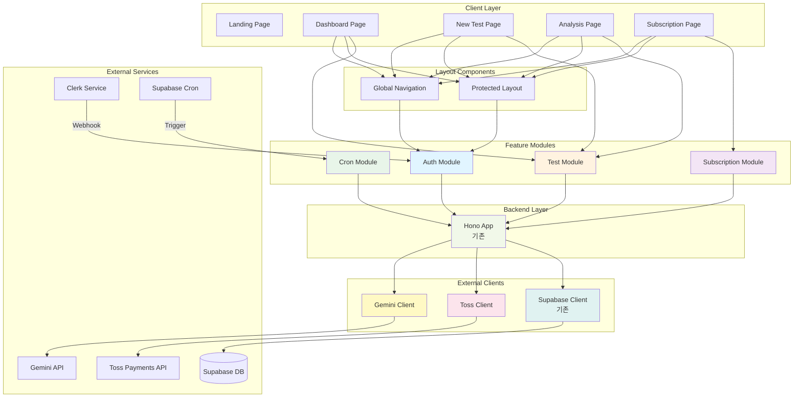

# Saju피아 공통 모듈 설계 문서

**프로젝트**: Saju피아 - AI 기반 사주팔자 분석 SaaS
**작성일**: 2025-12-12
**버전**: 2.0

---

## 1. 개요

이 문서는 페이지 단위 개발 이전에 구축되어야 하는 공통 모듈들을 정의합니다. 모든 공통 모듈은 **문서(PRD, requirement, userflow, database)에 명시된 요구사항만을 기반**으로 설계되었으며, 오버엔지니어링을 지양합니다.

### 1.1 공통 모듈 목록

| 모듈명 | 위치 | 설명 |
|--------|------|------|
| **Shared Layout** | `src/components/layout/` | Global Nav, Protected Layout |
| **Auth Module** | `src/features/auth/` | Clerk 인증, Webhook, Supabase 사용자 동기화 |
| **Test Module** | `src/features/test/` | 사주 검사, Gemini API 연동 |
| **Subscription Module** | `src/features/subscription/` | 토스페이먼츠 구독 관리 |
| **Cron Module** | `src/features/cron/` | 정기결제 처리 |
| **Gemini Client** | `src/lib/gemini/` | Gemini API 클라이언트 |
| **Toss Client** | `src/lib/toss/` | 토스페이먼츠 SDK/API 래퍼 |

### 1.2 기존 인프라 (재사용)

| 모듈명 | 위치 | 상태 |
|--------|------|------|
| Backend Core | `src/backend/hono/`, `src/backend/middleware/` | ✅ 완료 |
| HTTP Response | `src/backend/http/response.ts` | ✅ 완료 |
| Supabase Client | `src/lib/supabase/` | ✅ 완료 |
| API Client | `src/lib/remote/api-client.ts` | ✅ 완료 |
| UI Components | `src/components/ui/` | ✅ 18개 설치 완료 |
| Auth Context | `src/features/auth/context/`, `hooks/` | ✅ 완료 |

---

## 2. 모듈 간 의존성 다이어그램



---

## 3. Implementation Plan

### 3.1 Shared Layout Module

#### 3.1.1 개요
- **위치**: `src/components/layout/`
- **역할**: 모든 인증된 페이지에서 공통으로 사용되는 레이아웃 컴포넌트
- **의존성**: `@/features/auth/hooks/useCurrentUser`, `@/features/subscription/hooks/useSubscription`

#### 3.1.2 컴포넌트 구조
```
src/components/layout/
├── global-nav.tsx          # 좌측 글로벌 네비게이션
├── protected-layout.tsx    # 인증 보호 레이아웃 래퍼
└── nav-footer.tsx          # 네비게이션 하단 정보 (이메일, 잔여 횟수, 구독)
```

#### 3.1.3 구현 내용

**1. Global Navigation (`global-nav.tsx`)**

**QA Sheet**

| 항목 | 확인 사항 | 기대 결과 |
|------|-----------|-----------|
| 레이아웃 | 좌측 고정, w-64, h-screen | 화면 좌측에 고정된 세로 네비게이션 |
| 로고 | "Saju피아" + 아이콘 표시 | 상단에 로고와 아이콘 표시 |
| 메뉴 항목 | 대시보드, 새 검사 2개 | 2개 메뉴만 표시 |
| Active 상태 | 현재 경로와 일치하는 메뉴 하이라이트 | 활성 메뉴는 bg-accent 적용 |
| 하단 정보 | NavFooter 컴포넌트 렌더링 | 이메일, 잔여 횟수, 구독 정보 표시 |

**2. Nav Footer (`nav-footer.tsx`)**

**QA Sheet**

| 항목 | 확인 사항 | 기대 결과 |
|------|-----------|-----------|
| 이메일 | user.email 표시 | 사용자 이메일 표시 |
| 잔여 횟수 | remaining_tests/max_tests | Free: X/3, Pro: X/10 |
| 구독 버튼 | plan에 따라 variant 변경 | Free: outline, Pro: default |
| 클릭 이벤트 | 버튼 클릭 시 /subscription 이동 | 구독 관리 페이지로 이동 |
| 로딩 상태 | Skeleton UI 표시 | 로딩 중 3개 placeholder 표시 |

**3. Protected Layout (`protected-layout.tsx`)**

**QA Sheet**

| 항목 | 확인 사항 | 기대 결과 |
|------|-----------|-----------|
| 인증 체크 | isAuthenticated === false 시 리다이렉트 | /login 페이지로 이동 |
| 로딩 상태 | Spinner UI 표시 | 중앙에 로딩 스피너 표시 |
| 레이아웃 | GlobalNav + main content | 좌측 Nav, 우측 children |
| ml-64 | main content의 왼쪽 마진 | GlobalNav 너비만큼 오프셋 |

---

### 3.2 Auth Module

#### 3.2.1 개요
- **위치**: `src/features/auth/`
- **역할**: Clerk 인증, Webhook 처리, Supabase 사용자 동기화
- **의존성**: `@clerk/nextjs`, `@/backend/supabase`, `@/backend/http`

#### 3.2.2 디렉토리 구조
```
src/features/auth/
├── backend/
│   ├── route.ts          # Clerk Webhook 라우트
│   ├── service.ts        # 사용자 생성/삭제 로직
│   ├── schema.ts         # Webhook payload zod 스키마
│   └── error.ts          # Auth 에러 코드
├── hooks/
│   └── useCurrentUser.ts # 현재 사용자 훅 (기존 재사용)
├── context/
│   └── current-user-context.tsx # 사용자 컨텍스트 (기존 재사용)
└── types.ts              # Auth 타입 정의 (기존 재사용)
```

#### 3.2.3 Backend 구현

**1. Route (`backend/route.ts`)**

```typescript
// src/features/auth/backend/route.ts
import { Hono } from "hono";
import { zValidator } from "@hono/zod-validator";
import type { AppEnv } from "@/backend/hono/context";
import { respond } from "@/backend/http/response";
import { clerkWebhookSchema } from "./schema";
import { handleUserCreated, handleUserDeleted } from "./service";

export const registerAuthRoutes = (app: Hono<AppEnv>) => {
  app.post(
    "/api/auth/webhook",
    zValidator("json", clerkWebhookSchema),
    async (c) => {
      const body = c.req.valid("json");

      switch (body.type) {
        case "user.created":
          return respond(c, await handleUserCreated(c, body.data));

        case "user.deleted":
          return respond(c, await handleUserDeleted(c, body.data));

        default:
          return c.json({ message: "Webhook received" }, 200);
      }
    }
  );
};
```

**2. Service Layer (`backend/service.ts`) - 핵심 비즈니스 로직**

```typescript
// src/features/auth/backend/service.ts
import type { AppContext } from "@/backend/hono/context";
import { success, failure } from "@/backend/http/response";
import type { ClerkUserCreated, ClerkUserDeleted } from "./schema";
import { authErrorCodes } from "./error";

export const handleUserCreated = async (
  c: AppContext,
  data: ClerkUserCreated
) => {
  const supabase = c.get("supabase");
  const logger = c.get("logger");

  const email = data.email_addresses[0]?.email_address;

  if (!email) {
    return failure(400, authErrorCodes.EMAIL_MISSING, "이메일이 없습니다.");
  }

  try {
    // 1. users 테이블에 사용자 생성
    const { data: user, error: userError } = await supabase
      .from("users")
      .insert({
        clerk_user_id: data.id,
        email,
      })
      .select()
      .single();

    if (userError) {
      logger.error("User creation failed", userError);
      return failure(500, authErrorCodes.USER_CREATE_FAILED, "사용자 생성 실패");
    }

    // 2. subscriptions 테이블에 Free 플랜 생성
    const { error: subError } = await supabase
      .from("subscriptions")
      .insert({
        user_id: user.id,
        plan: "free",
        remaining_tests: 3,
      });

    if (subError) {
      logger.error("Subscription creation failed", subError);
      // Rollback: user 삭제
      await supabase.from("users").delete().eq("id", user.id);
      return failure(500, authErrorCodes.SUB_CREATE_FAILED, "구독 생성 실패");
    }

    logger.info("User created successfully", { user_id: user.id });

    return success({ user_id: user.id });
  } catch (error) {
    logger.error("Unexpected error", error);
    return failure(500, authErrorCodes.INTERNAL_ERROR, "서버 오류");
  }
};

export const handleUserDeleted = async (
  c: AppContext,
  data: ClerkUserDeleted
) => {
  const supabase = c.get("supabase");
  const logger = c.get("logger");

  try {
    // 1. 사용자의 구독 정보 조회 (빌링키 확인)
    const { data: user } = await supabase
      .from("users")
      .select(`
        id,
        subscriptions (
          billing_key
        )
      `)
      .eq("clerk_user_id", data.id)
      .single();

    // 2. Pro 구독인 경우 빌링키 삭제 (TODO: toss client 구현 후)
    if (user?.subscriptions?.billing_key) {
      logger.warn("Billing key deletion skipped (not implemented)", {
        user_id: user.id,
      });
      // await deleteTossBillingKey(user.subscriptions.billing_key);
    }

    // 3. 사용자 삭제 (CASCADE로 subscriptions, tests도 삭제됨)
    const { error } = await supabase
      .from("users")
      .delete()
      .eq("clerk_user_id", data.id);

    if (error) {
      logger.error("User deletion failed", error);
      return failure(500, authErrorCodes.USER_DELETE_FAILED, "사용자 삭제 실패");
    }

    logger.info("User deleted successfully", { clerk_user_id: data.id });

    return success({ message: "User deleted" });
  } catch (error) {
    logger.error("Unexpected error", error);
    return failure(500, authErrorCodes.INTERNAL_ERROR, "서버 오류");
  }
};
```

**3. Schema (`backend/schema.ts`)**

```typescript
// src/features/auth/backend/schema.ts
import { z } from "zod";

export const clerkWebhookSchema = z.discriminatedUnion("type", [
  z.object({
    type: z.literal("user.created"),
    data: z.object({
      id: z.string(),
      email_addresses: z.array(
        z.object({
          email_address: z.string().email(),
        })
      ),
    }),
  }),
  z.object({
    type: z.literal("user.deleted"),
    data: z.object({
      id: z.string(),
    }),
  }),
]);

export type ClerkWebhookPayload = z.infer<typeof clerkWebhookSchema>;
export type ClerkUserCreated = Extract<
  ClerkWebhookPayload,
  { type: "user.created" }
>["data"];
export type ClerkUserDeleted = Extract<
  ClerkWebhookPayload,
  { type: "user.deleted" }
>["data"];
```

**4. Error Codes (`backend/error.ts`)**

```typescript
// src/features/auth/backend/error.ts
export const authErrorCodes = {
  EMAIL_MISSING: "EMAIL_MISSING",
  USER_CREATE_FAILED: "USER_CREATE_FAILED",
  SUB_CREATE_FAILED: "SUB_CREATE_FAILED",
  USER_DELETE_FAILED: "USER_DELETE_FAILED",
  INTERNAL_ERROR: "INTERNAL_ERROR",
} as const;

export type AuthErrorCode =
  (typeof authErrorCodes)[keyof typeof authErrorCodes];
```

**Unit Tests**

```typescript
// src/features/auth/backend/service.test.ts
describe("Auth Service", () => {
  describe("handleUserCreated", () => {
    it("should create user and subscription", async () => {});
    it("should fail if email is missing", async () => {});
    it("should rollback on subscription creation failure", async () => {});
  });

  describe("handleUserDeleted", () => {
    it("should delete user successfully", async () => {});
    it("should handle billing key deletion", async () => {});
  });
});
```

---

### 3.3 Test Module

#### 3.3.1 개요
- **위치**: `src/features/test/`
- **역할**: 사주 검사 생성, Gemini API 연동, 검사 내역 조회
- **의존성**: `@/lib/gemini`, `@/backend/supabase`, `@/backend/http`

#### 3.3.2 디렉토리 구조
```
src/features/test/
├── backend/
│   ├── route.ts          # Test API 라우트
│   ├── service.ts        # 검사 생성/조회 로직
│   ├── schema.ts         # 요청/응답 스키마
│   └── error.ts          # Test 에러 코드
├── hooks/
│   ├── useCreateTest.ts  # 검사 생성 훅
│   ├── useTestList.ts    # 검사 목록 훅
│   └── useTestDetail.ts  # 검사 상세 훅
└── lib/
    └── dto.ts            # 클라이언트용 DTO 재노출
```

#### 3.3.3 Backend 구현 (요약)

**주요 기능:**
1. `POST /api/test/create`: 검사 생성 + Gemini 호출 + 잔여 횟수 차감
2. `GET /api/test/list?name=...&limit=20&offset=0`: 검사 목록 조회
3. `GET /api/test/:id`: 검사 상세 조회

**Unit Tests**

```typescript
describe("Test Service", () => {
  describe("createTest", () => {
    it("should check remaining_tests > 0", async () => {});
    it("should call Gemini API with correct model", async () => {});
    it("should decrement remaining_tests", async () => {});
    it("should rollback on Gemini API failure", async () => {});
  });

  describe("getTestList", () => {
    it("should filter by name", async () => {});
    it("should paginate results", async () => {});
  });
});
```

---

### 3.4 Subscription Module

#### 3.4.1 개요
- **위치**: `src/features/subscription/`
- **역할**: 토스페이먼츠 구독 관리, Pro 구독 시작/취소/철회
- **의존성**: `@/lib/toss`, `@/backend/supabase`, `@/backend/http`

#### 3.4.2 디렉토리 구조
```
src/features/subscription/
├── backend/
│   ├── route.ts          # Subscription API 라우트
│   ├── service.ts        # 구독 로직
│   ├── schema.ts         # 요청/응답 스키마
│   └── error.ts          # Subscription 에러 코드
├── hooks/
│   ├── useSubscription.ts            # 구독 정보 훅
│   ├── useCreateSubscription.ts      # Pro 구독 시작 훅
│   └── useCancelSubscription.ts      # 구독 취소 훅
└── lib/
    └── dto.ts            # 클라이언트용 DTO
```

#### 3.4.3 Backend 구현 (요약)

**주요 기능:**
1. `GET /api/subscription/status`: 구독 상태 조회
2. `POST /api/subscription/create`: Pro 구독 시작 (빌링키 + 첫 결제)
3. `POST /api/subscription/cancel`: 구독 취소 예약
4. `POST /api/subscription/reactivate`: 구독 취소 철회

**Unit Tests**

```typescript
describe("Subscription Service", () => {
  describe("createProSubscription", () => {
    it("should execute first payment via Toss", async () => {});
    it("should update plan to pro", async () => {});
    it("should rollback on payment failure", async () => {});
  });
});
```

---

### 3.5 Cron Module

#### 3.5.1 개요
- **위치**: `src/features/cron/`
- **역할**: Supabase Cron에서 호출되는 정기결제 처리
- **의존성**: `@/lib/toss`, `@/backend/supabase`, `@/backend/http`

#### 3.5.2 디렉토리 구조
```
src/features/cron/
├── backend/
│   ├── route.ts          # Cron API 라우트
│   ├── service.ts        # 정기결제 처리 로직
│   └── error.ts          # Cron 에러 코드
└── README.md             # Supabase Cron 설정 가이드
```

#### 3.5.3 Backend 구현 (요약)

**주요 기능:**
1. `POST /api/cron/daily-billing`: 매일 02:00 호출
2. 오늘이 결제일인 구독 조회
3. 각 구독에 대해 결제 시도
   - 성공: remaining_tests=10, next_billing_date+=1개월
   - 실패: plan=free, billing_key=NULL, 빌링키 삭제

**Unit Tests**

```typescript
describe("Cron Service", () => {
  describe("processDailyBilling", () => {
    it("should verify cron secret token", async () => {});
    it("should find subscriptions where next_billing_date = today", async () => {});
    it("should charge billing key for each subscription", async () => {});
    it("should handle payment success", async () => {});
    it("should handle payment failure", async () => {});
  });
});
```

---

### 3.6 Gemini Client

#### 3.6.1 개요
- **위치**: `src/lib/gemini/`
- **역할**: Google Gemini API 클라이언트
- **의존성**: `@ai-sdk/google`, `ai`

#### 3.6.2 디렉토리 구조
```
src/lib/gemini/
├── client.ts             # Gemini API 클라이언트
├── prompt.ts             # 사주 시스템 프롬프트
└── types.ts              # Gemini 타입 정의
```

#### 3.6.3 구현 내용

**1. Prompt (`prompt.ts`)**

```typescript
// src/lib/gemini/prompt.ts
export const generateSajuPrompt = (input: {
  name: string;
  birth_date: string;
  birth_time: string | null;
  gender: "male" | "female";
}): string => {
  return `당신은 20년 경력의 전문 사주팔자 상담사입니다.

**입력 정보**:
- 성함: ${input.name}
- 생년월일: ${input.birth_date}
- 출생시간: ${input.birth_time || "미상"}
- 성별: ${input.gender === "male" ? "남성" : "여성"}

**분석 요구사항**:
1️⃣ 천간(天干)과 지지(地支) 계산
2️⃣ 오행(五行) 분석 (목, 화, 토, 금, 수)
3️⃣ 대운(大運)과 세운(歲運) 해석
4️⃣ 전반적인 성격, 재운, 건강운, 연애운 분석

**출력 형식**: 마크다운

**금지 사항**:
- 의료·법률 조언
- 확정적 미래 예측
- 부정적·공격적 표현`;
};
```

**2. Client (`client.ts`)**

```typescript
// src/lib/gemini/client.ts
import { google } from "@ai-sdk/google";
import { generateText } from "ai";
import { generateSajuPrompt } from "./prompt";

export const generateSajuAnalysis = async (
  input: {
    name: string;
    birth_date: string;
    birth_time: string | null;
    gender: "male" | "female";
  },
  model: "gemini-2.5-flash" | "gemini-2.5-pro"
): Promise<string | null> => {
  try {
    const prompt = generateSajuPrompt(input);

    const { text } = await generateText({
      model: google(model),
      prompt,
      maxTokens: 2000,
      temperature: 0.7,
    });

    return text;
  } catch (error) {
    console.error("Gemini API error", error);
    return null;
  }
};
```

**Unit Tests**

```typescript
describe("Gemini Client", () => {
  it("should generate saju analysis", async () => {});
  it("should return null on API error", async () => {});
});
```

---

### 3.7 Toss Client

#### 3.7.1 개요
- **위치**: `src/lib/toss/`
- **역할**: 토스페이먼츠 SDK/API 래퍼
- **의존성**: `@tosspayments/tosspayments-sdk`, `axios`

#### 3.7.2 디렉토리 구조
```
src/lib/toss/
├── client.ts             # Toss API 클라이언트 (서버)
├── sdk.ts                # Toss SDK 래퍼 (클라이언트)
└── types.ts              # Toss 타입 정의
```

#### 3.7.3 구현 내용

**1. SDK Wrapper (`sdk.ts`)**

```typescript
// src/lib/toss/sdk.ts
"use client";

import { loadTossPayments } from "@tosspayments/tosspayments-sdk";

export const initTossPayments = async () => {
  const clientKey = process.env.NEXT_PUBLIC_TOSS_CLIENT_KEY;

  if (!clientKey) {
    throw new Error("NEXT_PUBLIC_TOSS_CLIENT_KEY is not defined");
  }

  return await loadTossPayments(clientKey);
};

export const requestBillingKey = async (params: {
  customerKey: string;
  successUrl: string;
  failUrl: string;
}) => {
  const tossPayments = await initTossPayments();

  return await tossPayments.requestBillingAuth("카드", {
    customerKey: params.customerKey,
    successUrl: params.successUrl,
    failUrl: params.failUrl,
  });
};
```

**2. API Client (`client.ts`)**

```typescript
// src/lib/toss/client.ts
import axios from "axios";

const TOSS_API_BASE_URL = "https://api.tosspayments.com/v1";

const tossClient = axios.create({
  baseURL: TOSS_API_BASE_URL,
  headers: {
    "Content-Type": "application/json",
    Authorization: `Basic ${Buffer.from(
      `${process.env.TOSS_SECRET_KEY}:`
    ).toString("base64")}`,
  },
});

export const chargeTossPayment = async (params: {
  billing_key: string;
  amount: number;
  customer_email: string;
}): Promise<{ success: boolean; error?: string }> => {
  try {
    await tossClient.post("/billing", {
      billingKey: params.billing_key,
      customerEmail: params.customer_email,
      amount: params.amount,
      orderId: `order_${Date.now()}`,
      orderName: "Saju피아 Pro 구독",
    });

    return { success: true };
  } catch (error: any) {
    return {
      success: false,
      error: error.response?.data?.message || "결제 실패",
    };
  }
};

export const deleteTossBillingKey = async (
  billing_key: string
): Promise<boolean> => {
  try {
    await tossClient.delete(`/billing/${billing_key}`);
    return true;
  } catch (error) {
    console.error("Failed to delete billing key", error);
    return false;
  }
};
```

**Unit Tests**

```typescript
describe("Toss Client", () => {
  it("should charge payment successfully", async () => {});
  it("should delete billing key", async () => {});
});
```

---

## 4. 통합 체크리스트

### 4.1 코드 충돌 방지 확인 (3회 검증)

#### 검증 1차: 모듈 간 독립성
- ✅ Shared Layout은 Auth Context만 의존 (다른 Feature 모듈과 독립)
- ✅ Auth Module은 Supabase Client만 의존 (다른 Feature 모듈과 독립)
- ✅ Test Module은 Gemini Client + Supabase만 의존 (Subscription과 독립)
- ✅ Subscription Module은 Toss Client + Supabase만 의존 (Test와 독립)
- ✅ Cron Module은 Toss Client + Supabase만 의존 (다른 Feature와 독립)

#### 검증 2차: Backend 라우트 충돌 확인
- ✅ Auth: `/api/auth/webhook`
- ✅ Test: `/api/test/create`, `/api/test/list`, `/api/test/:id`
- ✅ Subscription: `/api/subscription/status`, `/api/subscription/create`, `/api/subscription/cancel`, `/api/subscription/reactivate`
- ✅ Cron: `/api/cron/daily-billing`
- ✅ 모든 라우트 경로가 고유함

#### 검증 3차: Hono App 통합 확인
```typescript
// src/backend/hono/app.ts 수정 필요
import { registerAuthRoutes } from "@/features/auth/backend/route";
import { registerTestRoutes } from "@/features/test/backend/route";
import { registerSubscriptionRoutes } from "@/features/subscription/backend/route";
import { registerCronRoutes } from "@/features/cron/backend/route";

export const createHonoApp = () => {
  // Development: 매번 재생성 (HMR)
  if (singletonApp && process.env.NODE_ENV === "production") {
    return singletonApp;
  }

  const app = new Hono<AppEnv>();

  app.use("*", errorBoundary());
  app.use("*", withAppContext());
  app.use("*", withSupabase());

  // Feature 라우트 등록
  registerAuthRoutes(app);
  registerTestRoutes(app);
  registerSubscriptionRoutes(app);
  registerCronRoutes(app);

  if (process.env.NODE_ENV === "production") {
    singletonApp = app;
  }

  return app;
};
```

### 4.2 필수 shadcn-ui 컴포넌트

```bash
# 추가 필요 컴포넌트
npx shadcn@latest add input
npx shadcn@latest add select
npx shadcn@latest add radio-group
npx shadcn@latest add checkbox
npx shadcn@latest add calendar
npx shadcn@latest add skeleton
```

### 4.3 환경변수

```bash
# .env.local
NEXT_PUBLIC_SUPABASE_URL=
SUPABASE_URL=
NEXT_PUBLIC_SUPABASE_ANON_KEY=
SUPABASE_SERVICE_ROLE_KEY=

NEXT_PUBLIC_CLERK_PUBLISHABLE_KEY=
CLERK_SECRET_KEY=
CLERK_WEBHOOK_SECRET=

NEXT_PUBLIC_TOSS_CLIENT_KEY=
TOSS_SECRET_KEY=

GEMINI_API_KEY=

CRON_SECRET=
```

---

## 5. 페이지별 의존 공통 모듈 매핑

| 페이지 | 의존 모듈 | 비고 |
|--------|-----------|------|
| Landing Page | (없음) | 공개 페이지 |
| Dashboard | Protected Layout, Test Module | 검사 목록 조회 |
| New Test | Protected Layout, Test Module, Subscription Module | 잔여 횟수 확인 |
| Analysis Detail | Protected Layout, Test Module | 검사 상세 조회 |
| Subscription | Protected Layout, Subscription Module | 구독 관리 |

---

## 6. 다음 단계

이 공통 모듈 설계 문서가 승인되면, 다음 순서로 진행합니다:

1. **공통 모듈 구현** (병렬 작업 가능)
   - Shared Layout ⏱️ 3h
   - Auth Module (Webhook 포함) ⏱️ 5h
   - Test Module ⏱️ 6h
   - Subscription Module ⏱️ 6h
   - Cron Module ⏱️ 4h
   - Gemini Client ⏱️ 2h
   - Toss Client ⏱️ 3h

2. **페이지 단위 개발** (공통 모듈 구현 완료 후)
   - Landing Page ⏱️ 4h
   - Dashboard ⏱️ 3h
   - New Test ⏱️ 4h
   - Analysis Detail ⏱️ 3h
   - Subscription ⏱️ 4h

3. **통합 테스트**
   - E2E 테스트 ⏱️ 4h
   - Webhook 테스트 (Clerk, Supabase Cron) ⏱️ 2h
   - 결제 플로우 테스트 ⏱️ 3h

**총 예상 시간**: ~56시간

---

**문서 버전**: 2.0
**작성일**: 2025-12-12
**검증 완료**: 3회 (모듈 독립성, 라우트 충돌, Hono 통합)
**오버엔지니어링 방지**: 문서 명시 요구사항만 구현
