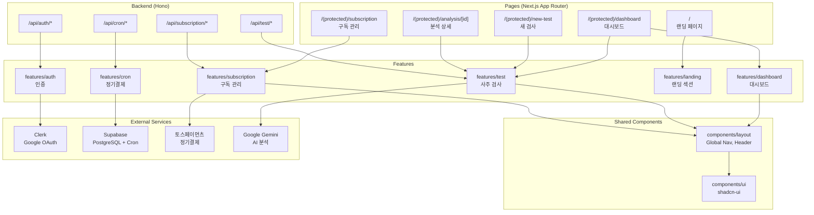
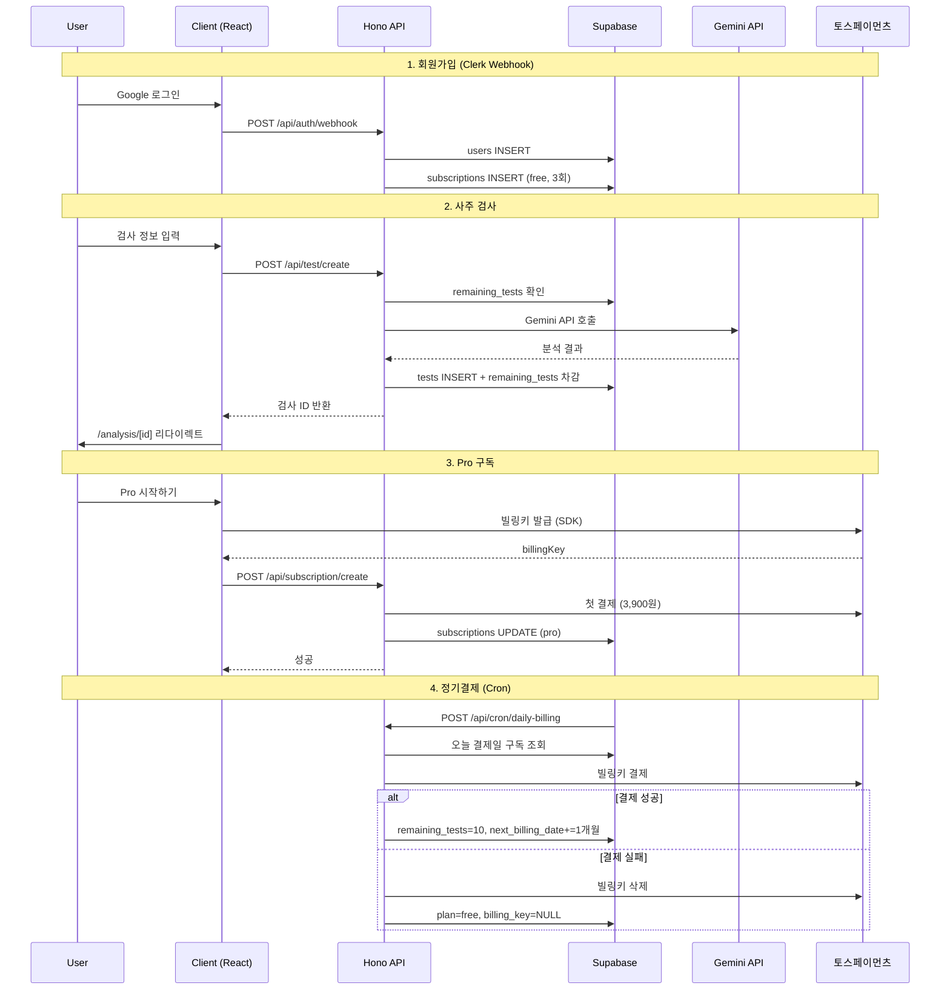
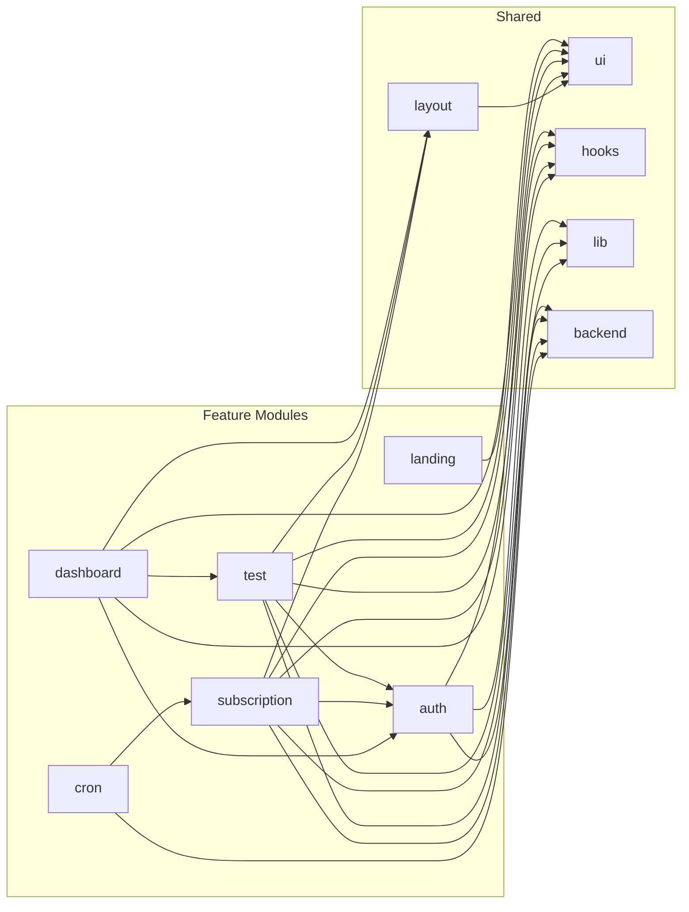

# Saju피아 공통 모듈 설계

**프로젝트**: Saju피아 - AI 기반 사주팔자 분석 SaaS
**작성일**: 2025-12-12
**버전**: 1.0

---

## 1. 개요

### 1.1 모듈 목록

| 모듈명 | 위치 | 설명 |
|--------|------|------|
| **Shared Layout** | `src/components/layout/` | Global Nav, Header, Footer 등 공통 레이아웃 |
| **Auth** | `src/features/auth/` | Clerk 기반 인증 (Google OAuth, Webhook) |
| **Test** | `src/features/test/` | 사주 검사 생성 및 조회 (Gemini API 연동) |
| **Subscription** | `src/features/subscription/` | 토스페이먼츠 구독 결제 |
| **Cron** | `src/features/cron/` | 정기결제 Cron Job |
| **Landing** | `src/features/landing/` | 랜딩 페이지 섹션 컴포넌트 |
| **Dashboard** | `src/features/dashboard/` | 대시보드 검사 내역 |

### 1.2 공통 인프라 (기존 구현 활용)

| 모듈명 | 위치 | 설명 |
|--------|------|------|
| Backend Core | `src/backend/` | Hono 앱, 미들웨어, 응답 헬퍼 |
| UI Components | `src/components/ui/` | shadcn-ui 컴포넌트 (18개) |
| API Client | `src/lib/remote/api-client.ts` | Axios 기반 HTTP 클라이언트 |
| Supabase Client | `src/lib/supabase/` | 브라우저/서버 Supabase 클라이언트 |
| Utils | `src/lib/utils.ts` | cn() 함수 등 유틸리티 |
| Constants | `src/constants/` | 환경 변수, 인증 경로 상수 |
| Hooks | `src/hooks/` | use-toast 등 공통 훅 |

---

## 2. Diagram

### 2.1 전체 아키텍처



### 2.2 데이터 흐름



### 2.3 Feature 모듈 의존관계



---

## 3. Implementation Plan

### 3.1 Shared Layout (`src/components/layout/`)

#### 구조
```
src/components/layout/
├── global-nav.tsx        # 좌측 글로벌 네비게이션
├── header.tsx            # 랜딩 페이지 헤더
├── protected-layout.tsx  # 인증된 페이지 레이아웃
└── index.ts              # 재노출
```

#### 구현 계획

| 컴포넌트 | 설명 | 의존성 |
|---------|------|--------|
| `GlobalNav` | 좌측 사이드바 (대시보드, 새검사, 사용자 정보) | `useCurrentUser`, `useSubscription` |
| `Header` | 랜딩 헤더 (로고, 메뉴, 시작하기 버튼) | `lucide-react`, `Button` |
| `ProtectedLayout` | 인증 페이지 공통 레이아웃 | `GlobalNav`, `useCurrentUser` |

#### QA Sheet

| 테스트 케이스 | 예상 결과 |
|--------------|----------|
| GlobalNav 렌더링 | 로고, 메뉴, 사용자 정보 표시 |
| 잔여 횟수 표시 | Free: X/3, Pro: X/10 형식 |
| 구독 상태 표시 | Free/Pro 배지 |
| 메뉴 네비게이션 | 대시보드, 새검사 클릭 시 이동 |
| 반응형 (모바일) | Sheet로 변환 |

---

### 3.2 Auth Feature (`src/features/auth/`)

#### 구조
```
src/features/auth/
├── backend/
│   ├── route.ts          # /api/auth/webhook
│   ├── service.ts        # Clerk Webhook 처리
│   ├── schema.ts         # Webhook 페이로드 스키마
│   └── error.ts          # 에러 코드
├── components/
│   ├── auth-button.tsx   # 로그인/로그아웃 버튼
│   └── user-info.tsx     # 사용자 정보 표시
├── hooks/
│   └── useCurrentUser.ts # 현재 사용자 훅 (기존 활용)
├── context/
│   └── current-user-context.tsx # 기존 활용
├── lib/
│   └── clerk.ts          # Clerk SDK 헬퍼
└── types.ts              # 타입 정의
```

#### 구현 계획

| 항목 | 파일 | 설명 |
|-----|------|------|
| Webhook Handler | `backend/route.ts` | `user.created`, `user.deleted` 이벤트 처리 |
| User Sync Service | `backend/service.ts` | Supabase users/subscriptions 동기화 |
| Webhook Schema | `backend/schema.ts` | Clerk Webhook 페이로드 Zod 스키마 |
| Auth Button | `components/auth-button.tsx` | ClerkProvider 기반 로그인/로그아웃 |
| User Info | `components/user-info.tsx` | 이메일, 아바타 표시 |

#### Unit Tests

```typescript
// backend/service.test.ts
describe('Auth Service', () => {
  describe('handleUserCreated', () => {
    it('should create user in Supabase', async () => {});
    it('should create free subscription with 3 tests', async () => {});
    it('should handle duplicate clerk_user_id', async () => {});
  });

  describe('handleUserDeleted', () => {
    it('should delete billing key if Pro', async () => {});
    it('should cascade delete user data', async () => {});
  });
});
```

---

### 3.3 Test Feature (`src/features/test/`)

#### 구조
```
src/features/test/
├── backend/
│   ├── route.ts          # /api/test/create, /api/test/list, /api/test/[id]
│   ├── service.ts        # 검사 생성, 조회, Gemini 호출
│   ├── schema.ts         # 요청/응답 스키마
│   ├── error.ts          # 에러 코드
│   └── prompt.ts         # Gemini 시스템 프롬프트
├── components/
│   ├── test-form.tsx           # 새 검사 폼
│   ├── test-card.tsx           # 검사 카드 (대시보드용)
│   ├── test-result.tsx         # 분석 결과 표시
│   └── test-info-card.tsx      # 검사 대상자 정보 카드
├── hooks/
│   ├── useCreateTest.ts        # 검사 생성 mutation
│   ├── useTestList.ts          # 검사 목록 query
│   └── useTestDetail.ts        # 검사 상세 query
└── lib/
    └── dto.ts                  # 스키마 재노출
```

#### 구현 계획

| 항목 | 파일 | 설명 |
|-----|------|------|
| Create Test API | `backend/route.ts` | POST /api/test/create |
| List Tests API | `backend/route.ts` | GET /api/test/list?search=... |
| Get Test API | `backend/route.ts` | GET /api/test/:id |
| Gemini Service | `backend/service.ts` | Gemini API 호출 및 응답 처리 |
| System Prompt | `backend/prompt.ts` | 사주 분석 프롬프트 템플릿 |
| Test Form | `components/test-form.tsx` | React Hook Form + shadcn-ui |
| Test Card | `components/test-card.tsx` | 대시보드 카드 컴포넌트 |
| Test Result | `components/test-result.tsx` | react-markdown 렌더링 |

#### Unit Tests

```typescript
// backend/service.test.ts
describe('Test Service', () => {
  describe('createTest', () => {
    it('should check remaining_tests > 0', async () => {});
    it('should call Gemini API with correct prompt', async () => {});
    it('should use flash model for free plan', async () => {});
    it('should use pro model for pro plan', async () => {});
    it('should decrement remaining_tests', async () => {});
    it('should rollback on Gemini API failure', async () => {});
  });

  describe('getTestById', () => {
    it('should return test with analysis_result', async () => {});
    it('should verify user ownership', async () => {});
    it('should return 404 for non-existent test', async () => {});
  });

  describe('listTests', () => {
    it('should return tests ordered by created_at DESC', async () => {});
    it('should filter by name search', async () => {});
    it('should paginate results', async () => {});
  });
});
```

#### QA Sheet (Components)

| 테스트 케이스 | 예상 결과 |
|--------------|----------|
| 이름 필수 입력 검증 | 비어있으면 에러 메시지 |
| 생년월일 캘린더 | 오늘 이전 날짜만 선택 가능 |
| 출생시간 선택 | AM/PM 12시간 형식 |
| "출생시간 모름" 체크 | 시간 입력 비활성화 |
| 성별 라디오 버튼 | 남성/여성 중 하나 선택 |
| 검사 시작 버튼 | 필수 필드 입력 후 활성화 |
| 잔여 횟수 0 | 버튼 비활성화 + 업그레이드 안내 |
| 로딩 상태 | 스피너 + "분석 중..." |
| 분석 결과 렌더링 | 마크다운 → HTML |

---

### 3.4 Subscription Feature (`src/features/subscription/`)

#### 구조
```
src/features/subscription/
├── backend/
│   ├── route.ts          # /api/subscription/*
│   ├── service.ts        # 구독 생성, 취소, 철회
│   ├── schema.ts         # 요청/응답 스키마
│   ├── error.ts          # 에러 코드
│   └── toss.ts           # 토스페이먼츠 API 래퍼
├── components/
│   ├── subscription-card.tsx     # 현재 구독 정보 카드
│   ├── upgrade-card.tsx          # 업그레이드 유도 카드
│   ├── cancel-modal.tsx          # 취소 확인 모달
│   └── toss-payment.tsx          # 토스페이먼츠 SDK 래퍼
├── hooks/
│   ├── useSubscription.ts        # 구독 상태 query
│   ├── useCreateSubscription.ts  # Pro 구독 생성 mutation
│   └── useCancelSubscription.ts  # 구독 취소 mutation
├── constants/
│   └── plan.ts           # 플랜 상수 (가격, 횟수)
└── lib/
    └── dto.ts            # 스키마 재노출
```

#### 구현 계획

| 항목 | 파일 | 설명 |
|-----|------|------|
| Get Status API | `backend/route.ts` | GET /api/subscription/status |
| Create Pro API | `backend/route.ts` | POST /api/subscription/create |
| Cancel API | `backend/route.ts` | POST /api/subscription/cancel |
| Reactivate API | `backend/route.ts` | POST /api/subscription/reactivate |
| Toss API Wrapper | `backend/toss.ts` | 빌링키 발급, 결제, 삭제 |
| Subscription Card | `components/subscription-card.tsx` | Free/Pro 상태별 UI |
| Upgrade Card | `components/upgrade-card.tsx` | Pro 혜택 강조 |
| Cancel Modal | `components/cancel-modal.tsx` | 취소 확인 Dialog |
| Toss SDK | `components/toss-payment.tsx` | 빌링키 발급 UI |

#### Unit Tests

```typescript
// backend/service.test.ts
describe('Subscription Service', () => {
  describe('createProSubscription', () => {
    it('should execute first payment via Toss', async () => {});
    it('should update plan to pro', async () => {});
    it('should set remaining_tests to 10', async () => {});
    it('should set next_billing_date to +1 month', async () => {});
    it('should handle already Pro user', async () => {});
    it('should rollback on payment failure', async () => {});
  });

  describe('cancelSubscription', () => {
    it('should set cancel_at_period_end to true', async () => {});
    it('should keep status active', async () => {});
    it('should handle already cancelled', async () => {});
  });

  describe('reactivateSubscription', () => {
    it('should set cancel_at_period_end to false', async () => {});
    it('should verify period not expired', async () => {});
  });
});

// backend/toss.test.ts
describe('Toss API Wrapper', () => {
  describe('chargeBillingKey', () => {
    it('should call Toss billing API', async () => {});
    it('should return payment key on success', async () => {});
    it('should return error on failure', async () => {});
  });

  describe('deleteBillingKey', () => {
    it('should delete billing key', async () => {});
  });
});
```

#### QA Sheet (Components)

| 테스트 케이스 | 예상 결과 |
|--------------|----------|
| Free 상태 표시 | 잔여 X/3, Flash 모델, 업그레이드 버튼 |
| Pro 상태 표시 | 잔여 X/10, 다음 결제일, Pro 모델 |
| Pro 취소 예정 표시 | "취소 예정" 배지, 종료일 안내, 취소 철회 버튼 |
| Pro 시작하기 클릭 | 토스페이먼츠 SDK 팝업 |
| 빌링키 발급 후 | 첫 결제 실행 → 성공 시 Pro 전환 |
| 구독 취소 클릭 | 확인 모달 표시 |
| 취소 확인 | cancel_at_period_end = true |
| 취소 철회 | cancel_at_period_end = false |

---

### 3.5 Cron Feature (`src/features/cron/`)

#### 구조
```
src/features/cron/
├── backend/
│   ├── route.ts          # /api/cron/daily-billing
│   ├── service.ts        # 정기결제 처리 로직
│   └── error.ts          # 에러 코드
└── constants/
    └── index.ts          # Cron 비밀 토큰
```

#### 구현 계획

| 항목 | 파일 | 설명 |
|-----|------|------|
| Daily Billing API | `backend/route.ts` | POST /api/cron/daily-billing |
| Billing Service | `backend/service.ts` | 결제일 구독 조회, 결제 실행 |

#### Unit Tests

```typescript
// backend/service.test.ts
describe('Cron Service', () => {
  describe('processDailyBilling', () => {
    it('should verify cron secret token', async () => {});
    it('should find subscriptions where next_billing_date = today', async () => {});
    it('should skip cancelled subscriptions', async () => {});
    it('should charge billing key for each subscription', async () => {});

    describe('on payment success', () => {
      it('should reset remaining_tests to 10', async () => {});
      it('should extend next_billing_date by 1 month', async () => {});
    });

    describe('on payment failure', () => {
      it('should set plan to free', async () => {});
      it('should clear billing_key', async () => {});
      it('should set remaining_tests to 0', async () => {});
      it('should delete Toss billing key', async () => {});
    });

    describe('expired subscriptions', () => {
      it('should process cancel_at_period_end = true', async () => {});
      it('should convert to free plan', async () => {});
    });
  });
});
```

---

### 3.6 Landing Feature (`src/features/landing/`)

#### 구조
```
src/features/landing/
├── components/
│   ├── hero-section.tsx      # 히어로 섹션
│   ├── service-section.tsx   # 서비스 소개 (카드 3개)
│   ├── pricing-section.tsx   # 요금제 (Free/Pro 카드)
│   ├── faq-section.tsx       # FAQ 아코디언
│   └── footer.tsx            # 푸터
└── constants/
    ├── faq-items.ts          # FAQ 질문/답변
    └── pricing-plans.ts      # 플랜 정보
```

#### 구현 계획

| 항목 | 파일 | 설명 |
|-----|------|------|
| Hero Section | `components/hero-section.tsx` | 타이틀, CTA 버튼, 배경 이미지 |
| Service Section | `components/service-section.tsx` | AI 분석, 가격, 영구 보관 카드 |
| Pricing Section | `components/pricing-section.tsx` | Free/Pro 플랜 카드 |
| FAQ Section | `components/faq-section.tsx` | Accordion 활용 |
| Footer | `components/footer.tsx` | 저작권 정보 |

#### QA Sheet

| 테스트 케이스 | 예상 결과 |
|--------------|----------|
| 히어로 이미지 로드 | picsum.photos 랜덤 이미지 |
| 이미지 로드 실패 | 폴백 이미지 표시 |
| "무료 시작하기" 클릭 | Clerk 로그인 모달 |
| "자세히 알아보기" 클릭 | 서비스 섹션으로 스크롤 |
| Free "시작하기" 클릭 | Clerk 로그인 모달 |
| Pro "시작하기" 클릭 | 로그인 → /subscription |
| FAQ 아코디언 클릭 | 펼침/접힘 애니메이션 |
| 앵커 링크 (홈,서비스,가격,FAQ) | 부드러운 스크롤 |

---

### 3.7 Dashboard Feature (`src/features/dashboard/`)

#### 구조
```
src/features/dashboard/
├── components/
│   ├── test-list.tsx         # 검사 카드 리스트
│   ├── search-bar.tsx        # 이름 검색창
│   ├── empty-state.tsx       # 검사 없음 상태
│   └── stats-header.tsx      # 총 N건 표시
└── hooks/
    └── useTestSearch.ts      # 검색어 상태 관리
```

#### 구현 계획

| 항목 | 파일 | 설명 |
|-----|------|------|
| Test List | `components/test-list.tsx` | 검사 카드 그리드 |
| Search Bar | `components/search-bar.tsx` | 실시간 필터링 |
| Empty State | `components/empty-state.tsx` | "아직 검사 내역이 없습니다" |
| Stats Header | `components/stats-header.tsx` | "총 N건의 검사 내역" |

#### QA Sheet

| 테스트 케이스 | 예상 결과 |
|--------------|----------|
| 검사 내역 로드 | 최신순 정렬된 카드 리스트 |
| 검사 내역 없음 | Empty State + "새 검사 시작" 버튼 |
| 이름 검색 | 실시간 필터링 |
| 검색 결과 없음 | "검색 결과가 없습니다" |
| 카드 클릭 | /analysis/[id]로 이동 |
| 카드 호버 | 하이라이트 효과 |
| 모델 배지 | Flash/Pro 표시 |

---

## 4. 추가 설치 필요 컴포넌트

### shadcn-ui 추가 설치
```bash
# 필요시 추가 설치
npx shadcn@latest add calendar       # 날짜 선택
npx shadcn@latest add radio-group    # 성별 선택
npx shadcn@latest add skeleton       # 로딩 상태
npx shadcn@latest add progress       # 분석 진행률
```

### 추가 패키지
```bash
npm install @clerk/nextjs            # Clerk 인증
npm install @tosspayments/payment-sdk # 토스페이먼츠 SDK
npm install react-markdown remark-gfm # 마크다운 렌더링
npm install @google/generative-ai     # Gemini API
```

---

## 5. 환경 변수

### 추가 필요 환경 변수
```bash
# .env.local

# Clerk
NEXT_PUBLIC_CLERK_PUBLISHABLE_KEY=
CLERK_SECRET_KEY=
CLERK_WEBHOOK_SECRET=

# 토스페이먼츠
NEXT_PUBLIC_TOSS_CLIENT_KEY=
TOSS_SECRET_KEY=

# Gemini
GEMINI_API_KEY=

# Cron
CRON_SECRET=
```

---

## 6. 마이그레이션 순서

### Phase 1: 인프라 구축
1. 환경 변수 설정
2. Clerk SDK 설치 및 Provider 설정
3. DB 마이그레이션 (`supabase/migrations/`)
4. 공통 레이아웃 컴포넌트 구현

### Phase 2: 인증
1. Auth feature 구현
2. Clerk Webhook 설정
3. 현재 사용자 컨텍스트 통합

### Phase 3: 사주 검사
1. Test feature backend 구현
2. Gemini API 연동
3. Test feature frontend 구현

### Phase 4: 구독 관리
1. Subscription feature backend 구현
2. 토스페이먼츠 SDK 연동
3. Subscription feature frontend 구현

### Phase 5: Cron
1. Cron feature 구현
2. Supabase Cron 설정

### Phase 6: 페이지 조립
1. 랜딩 페이지 구현
2. 대시보드 페이지 구현
3. 새 검사 페이지 구현
4. 분석 상세 페이지 구현
5. 구독 관리 페이지 구현

---

## 7. 파일 구조 요약

```
src/
├── app/
│   ├── layout.tsx                    # ClerkProvider + QueryProvider
│   ├── page.tsx                      # 랜딩 페이지
│   ├── (protected)/
│   │   ├── layout.tsx                # ProtectedLayout
│   │   ├── dashboard/page.tsx        # 대시보드
│   │   ├── new-test/page.tsx         # 새 검사
│   │   ├── analysis/[id]/page.tsx    # 분석 상세
│   │   └── subscription/page.tsx     # 구독 관리
│   └── api/[[...hono]]/route.ts      # Hono 엔트리포인트
│
├── backend/                          # 기존 유지
│   ├── hono/
│   ├── middleware/
│   ├── http/
│   ├── config/
│   └── supabase/
│
├── components/
│   ├── ui/                           # shadcn-ui (기존 + 추가)
│   └── layout/
│       ├── global-nav.tsx
│       ├── header.tsx
│       └── protected-layout.tsx
│
├── features/
│   ├── auth/
│   │   ├── backend/
│   │   ├── components/
│   │   ├── hooks/
│   │   ├── context/
│   │   ├── lib/
│   │   └── types.ts
│   │
│   ├── test/
│   │   ├── backend/
│   │   ├── components/
│   │   ├── hooks/
│   │   └── lib/
│   │
│   ├── subscription/
│   │   ├── backend/
│   │   ├── components/
│   │   ├── hooks/
│   │   ├── constants/
│   │   └── lib/
│   │
│   ├── cron/
│   │   ├── backend/
│   │   └── constants/
│   │
│   ├── landing/
│   │   ├── components/
│   │   └── constants/
│   │
│   └── dashboard/
│       ├── components/
│       └── hooks/
│
├── hooks/                            # 기존 유지
├── lib/                              # 기존 유지
└── constants/                        # 기존 유지
```

---

**문서 버전**: 1.0
**작성일**: 2025-12-12
**작성자**: Claude Code
