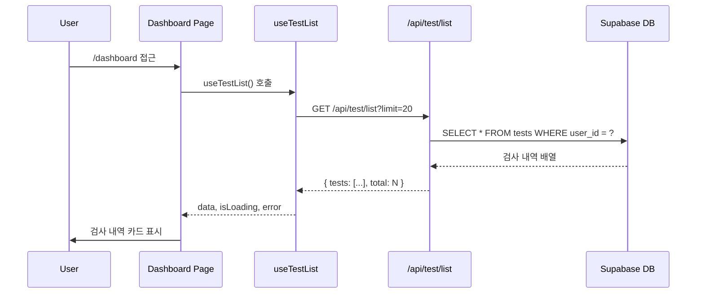
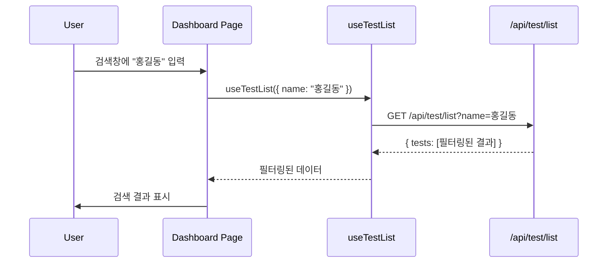

# 대시보드 (검사 내역 목록) 페이지 구현 계획

**페이지 경로**: `/dashboard`
**페이지 번호**: 2
**작성일**: 2025-12-12
**버전**: 1.0

---

## 1. 페이지 개요

### 1.1 목적
사용자가 과거에 수행한 모든 사주팔자 검사 내역을 확인하고, 이름 기반 검색을 통해 특정 검사를 빠르게 찾을 수 있는 페이지입니다.

### 1.2 주요 기능
- ✅ 검사 내역 카드 리스트 (최신순 정렬)
- ✅ 이름 기반 검색 (실시간 필터링)
- ✅ Empty State (검사 내역 없을 때)
- ✅ 검색 결과 없음 상태
- ✅ Global Nav 통합

### 1.3 접근 권한
- **인증 필요**: ✅ (Protected Layout 적용)
- **구독 필요**: ❌ (Free/Pro 모두 접근 가능)

---

## 2. 페이지 구조

### 2.1 컴포넌트 트리
```
/dashboard (page.tsx)
├── ProtectedLayout
│   ├── GlobalNav
│   │   ├── Logo + 아이콘
│   │   ├── 대시보드 메뉴 (active)
│   │   ├── 새 검사 메뉴
│   │   └── NavFooter
│   │       ├── 이메일
│   │       ├── 잔여 횟수
│   │       └── 구독 정보 버튼
│   └── MainContent
│       ├── PageHeader
│       │   └── 제목 + 설명
│       ├── SearchBar
│       │   ├── Input (검색창)
│       │   └── Search Icon
│       ├── TestCount
│       │   └── "총 N건의 검사 내역"
│       └── TestCardList
│           ├── TestCard (반복)
│           │   ├── 이름
│           │   ├── 생년월일
│           │   ├── 검사 일시
│           │   ├── 모델 배지 (Flash/Pro)
│           │   └── 호버 효과
│           ├── EmptyState (내역 없음)
│           │   ├── 아이콘
│           │   ├── 메시지
│           │   └── "새 검사 시작" 버튼
│           └── NoSearchResults (검색 결과 없음)
│               ├── 아이콘
│               ├── 메시지
│               └── 검색어 초기화 버튼
```

### 2.2 파일 구조
```
src/app/dashboard/
└── page.tsx                      # 대시보드 메인 페이지

src/features/test/
├── components/
│   ├── test-card.tsx             # 검사 내역 카드
│   ├── test-card-list.tsx        # 카드 리스트 + Empty State
│   ├── test-search-bar.tsx       # 검색창
│   └── empty-test-state.tsx      # Empty State 컴포넌트
├── hooks/
│   └── useTestList.ts            # 검사 목록 조회 훅 (기존)
└── types.ts                      # Test 타입 정의 (기존)
```

---

## 3. 데이터 플로우

### 3.1 초기 로딩 플로우


### 3.2 검색 플로우


### 3.3 Empty State 플로우
```
사용자 로그인 → 검사 내역 조회 → tests.length === 0
  → EmptyState 컴포넌트 표시
    → "새 검사 시작" 버튼 클릭
      → /new-test 페이지로 이동
```

---

## 4. API 스펙

### 4.1 검사 목록 조회 API

#### Endpoint
```
GET /api/test/list
```

#### Query Parameters
| 파라미터 | 타입 | 필수 | 설명 |
|----------|------|------|------|
| name | string | ❌ | 이름 검색어 (부분 일치) |
| limit | number | ❌ | 페이지당 항목 수 (기본값: 20) |
| offset | number | ❌ | 오프셋 (기본값: 0) |

#### Request Headers
```http
Authorization: Bearer {clerk_token}
```

#### Response (성공)
```typescript
{
  success: true,
  data: {
    tests: [
      {
        id: "uuid",
        name: "홍길동",
        birth_date: "1990-01-01",
        birth_time: "14:30:00",
        gender: "male",
        created_at: "2025-12-10T10:30:00Z"
      }
    ],
    total: 5
  }
}
```

#### Response (실패)
```typescript
{
  success: false,
  error: {
    code: "UNAUTHORIZED",
    message: "인증이 필요합니다"
  }
}
```

#### Error Codes
- `UNAUTHORIZED`: 인증 실패
- `FORBIDDEN`: 권한 없음 (다른 사용자의 데이터 접근 시도)
- `INTERNAL_ERROR`: 서버 오류

---

## 5. 상태 관리

### 5.1 React Query 훅 (`useTestList`)

```typescript
// src/features/test/hooks/useTestList.ts
import { useQuery } from "@tanstack/react-query";
import { apiClient } from "@/lib/remote/api-client";

export type TestListParams = {
  name?: string;
  limit?: number;
  offset?: number;
};

export type TestListItem = {
  id: string;
  name: string;
  birth_date: string;
  birth_time: string | null;
  gender: "male" | "female";
  created_at: string;
};

export type TestListResponse = {
  tests: TestListItem[];
  total: number;
};

export const useTestList = (params?: TestListParams) => {
  return useQuery({
    queryKey: ["test", "list", params],
    queryFn: async () => {
      const response = await apiClient.get<TestListResponse>("/api/test/list", {
        params,
      });
      return response.data;
    },
    staleTime: 1000 * 60 * 5, // 5분
  });
};
```

### 5.2 로컬 상태 (검색어)

```typescript
// page.tsx 내부
const [searchQuery, setSearchQuery] = useState("");

// 디바운스 적용 (선택)
const debouncedSearch = useDebounce(searchQuery, 300);

// React Query에 전달
const { data, isLoading } = useTestList({
  name: debouncedSearch,
  limit: 20,
});
```

---

## 6. 컴포넌트 상세 설계

### 6.1 Dashboard Page (`page.tsx`)

```typescript
// src/app/dashboard/page.tsx
"use client";

import { useState } from "react";
import { ProtectedLayout } from "@/components/layout/protected-layout";
import { TestSearchBar } from "@/features/test/components/test-search-bar";
import { TestCardList } from "@/features/test/components/test-card-list";
import { useTestList } from "@/features/test/hooks/useTestList";

export default async function DashboardPage() {
  const [searchQuery, setSearchQuery] = useState("");

  const { data, isLoading, error } = useTestList({
    name: searchQuery || undefined,
    limit: 20,
  });

  return (
    <ProtectedLayout>
      <div className="container mx-auto px-6 py-8">
        {/* Page Header */}
        <div className="mb-8">
          <h1 className="text-3xl font-bold tracking-tight">
            과거에 수행한 사주 팔자 검사 내역을 확인할 수 있습니다.
          </h1>
        </div>

        {/* Search Bar */}
        <TestSearchBar
          value={searchQuery}
          onChange={setSearchQuery}
          placeholder="성함으로 검색하세요"
        />

        {/* Test Count */}
        {!isLoading && data && (
          <div className="mt-6 mb-4 text-sm text-muted-foreground">
            총 {data.total}건의 검사 내역
          </div>
        )}

        {/* Test List */}
        <TestCardList
          tests={data?.tests || []}
          isLoading={isLoading}
          searchQuery={searchQuery}
          onClearSearch={() => setSearchQuery("")}
        />

        {/* Error State */}
        {error && (
          <div className="mt-8 text-center text-destructive">
            검사 내역을 불러오는 데 실패했습니다.
          </div>
        )}
      </div>
    </ProtectedLayout>
  );
}
```

**QA Sheet**

| 항목 | 확인 사항 | 기대 결과 |
|------|-----------|-----------|
| 인증 체크 | ProtectedLayout 적용 | 미인증 시 /login 리다이렉트 |
| 페이지 제목 | "과거에 수행한 사주 팔자..." 표시 | h1, text-3xl, font-bold |
| 검색창 | TestSearchBar 렌더링 | placeholder 표시 |
| 검사 건수 | total 값 표시 | "총 N건의 검사 내역" |
| 카드 리스트 | TestCardList 렌더링 | 검사 카드들 표시 |
| 로딩 상태 | isLoading=true 시 Skeleton | Skeleton UI 표시 |
| 에러 상태 | error 존재 시 에러 메시지 | 빨간색 에러 텍스트 |

---

### 6.2 Test Search Bar (`test-search-bar.tsx`)

```typescript
// src/features/test/components/test-search-bar.tsx
"use client";

import { Input } from "@/components/ui/input";
import { Search } from "lucide-react";

type TestSearchBarProps = {
  value: string;
  onChange: (value: string) => void;
  placeholder?: string;
};

export const TestSearchBar = ({
  value,
  onChange,
  placeholder = "검색하세요",
}: TestSearchBarProps) => {
  return (
    <div className="relative">
      <Search className="absolute left-3 top-1/2 -translate-y-1/2 h-4 w-4 text-muted-foreground" />
      <Input
        type="text"
        value={value}
        onChange={(e) => onChange(e.target.value)}
        placeholder={placeholder}
        className="pl-10"
      />
    </div>
  );
};
```

**QA Sheet**

| 항목 | 확인 사항 | 기대 결과 |
|------|-----------|-----------|
| Input 렌더링 | shadcn Input 컴포넌트 사용 | 입력 가능 |
| Search 아이콘 | 좌측에 돋보기 아이콘 | pl-10 적용 |
| value 동기화 | value prop 반영 | 입력 시 onChange 호출 |
| placeholder | placeholder prop 표시 | 빈 상태 시 안내 텍스트 |

---

### 6.3 Test Card List (`test-card-list.tsx`)

```typescript
// src/features/test/components/test-card-list.tsx
"use client";

import { TestCard } from "./test-card";
import { EmptyTestState } from "./empty-test-state";
import { Skeleton } from "@/components/ui/skeleton";
import type { TestListItem } from "../hooks/useTestList";

type TestCardListProps = {
  tests: TestListItem[];
  isLoading: boolean;
  searchQuery: string;
  onClearSearch: () => void;
};

export const TestCardList = ({
  tests,
  isLoading,
  searchQuery,
  onClearSearch,
}: TestCardListProps) => {
  // 로딩 상태
  if (isLoading) {
    return (
      <div className="grid gap-4 md:grid-cols-2 lg:grid-cols-3">
        {Array.from({ length: 6 }).map((_, i) => (
          <Skeleton key={i} className="h-48 rounded-lg" />
        ))}
      </div>
    );
  }

  // Empty State (검사 내역 없음)
  if (tests.length === 0 && !searchQuery) {
    return <EmptyTestState />;
  }

  // 검색 결과 없음
  if (tests.length === 0 && searchQuery) {
    return (
      <div className="mt-12 text-center">
        <p className="text-muted-foreground">
          "{searchQuery}"에 대한 검색 결과가 없습니다.
        </p>
        <button
          onClick={onClearSearch}
          className="mt-4 text-primary underline"
        >
          검색어 초기화
        </button>
      </div>
    );
  }

  // 검사 카드 리스트
  return (
    <div className="grid gap-4 md:grid-cols-2 lg:grid-cols-3">
      {tests.map((test) => (
        <TestCard key={test.id} test={test} />
      ))}
    </div>
  );
};
```

**QA Sheet**

| 항목 | 확인 사항 | 기대 결과 |
|------|-----------|-----------|
| 로딩 Skeleton | isLoading=true 시 6개 표시 | Skeleton 카드들 표시 |
| Empty State | tests.length=0 && !searchQuery | EmptyTestState 컴포넌트 |
| 검색 결과 없음 | tests.length=0 && searchQuery | "검색 결과 없음" 메시지 |
| 검색 초기화 | 버튼 클릭 시 onClearSearch | searchQuery 초기화 |
| 카드 그리드 | md:2열, lg:3열 | 반응형 그리드 |
| 카드 매핑 | tests 배열 순회 | 각 test에 대한 카드 |

---

### 6.4 Test Card (`test-card.tsx`)

```typescript
// src/features/test/components/test-card.tsx
"use client";

import { useRouter } from "next/navigation";
import { Card, CardHeader, CardContent, CardFooter } from "@/components/ui/card";
import { Badge } from "@/components/ui/badge";
import { Calendar, Clock, User } from "lucide-react";
import type { TestListItem } from "../hooks/useTestList";
import { format } from "date-fns";
import { ko } from "date-fns/locale";

type TestCardProps = {
  test: TestListItem;
};

export const TestCard = ({ test }: TestCardProps) => {
  const router = useRouter();

  const handleClick = () => {
    router.push(`/analysis/${test.id}`);
  };

  // 날짜 포맷팅
  const birthDate = format(new Date(test.birth_date), "yyyy년 MM월 dd일");
  const createdAt = format(
    new Date(test.created_at),
    "yyyy.MM.dd HH:mm",
    { locale: ko }
  );

  return (
    <Card
      className="cursor-pointer transition-all hover:shadow-lg hover:scale-[1.02]"
      onClick={handleClick}
    >
      <CardHeader>
        <div className="flex items-center justify-between">
          <div className="flex items-center gap-2">
            <User className="h-4 w-4 text-muted-foreground" />
            <h3 className="text-lg font-semibold">{test.name}</h3>
          </div>
          <Badge variant="outline">
            {test.gender === "male" ? "남성" : "여성"}
          </Badge>
        </div>
      </CardHeader>

      <CardContent className="space-y-2">
        <div className="flex items-center gap-2 text-sm text-muted-foreground">
          <Calendar className="h-4 w-4" />
          <span>{birthDate}</span>
        </div>

        {test.birth_time && (
          <div className="flex items-center gap-2 text-sm text-muted-foreground">
            <Clock className="h-4 w-4" />
            <span>{test.birth_time.slice(0, 5)}</span>
          </div>
        )}
      </CardContent>

      <CardFooter className="justify-between">
        <span className="text-xs text-muted-foreground">
          검사 일시: {createdAt}
        </span>
      </CardFooter>
    </Card>
  );
};
```

**QA Sheet**

| 항목 | 확인 사항 | 기대 결과 |
|------|-----------|-----------|
| Card 컴포넌트 | shadcn Card 사용 | Header, Content, Footer |
| 호버 효과 | hover:shadow-lg, scale-[1.02] | 카드 확대 + 그림자 |
| 클릭 이벤트 | onClick → router.push | /analysis/:id 이동 |
| 이름 표시 | test.name | User 아이콘 + 이름 |
| 성별 배지 | "남성" / "여성" | outline variant |
| 생년월일 | "yyyy년 MM월 dd일" | Calendar 아이콘 |
| 출생시간 | birth_time 있을 때만 | Clock 아이콘 + HH:mm |
| 검사 일시 | "yyyy.MM.dd HH:mm" | Footer에 표시 |
| 커서 | cursor-pointer | 마우스 오버 시 손가락 |

---

### 6.5 Empty Test State (`empty-test-state.tsx`)

```typescript
// src/features/test/components/empty-test-state.tsx
"use client";

import { useRouter } from "next/navigation";
import { Button } from "@/components/ui/button";
import { FileQuestion } from "lucide-react";

export const EmptyTestState = () => {
  const router = useRouter();

  return (
    <div className="mt-12 flex flex-col items-center justify-center space-y-4">
      <FileQuestion className="h-16 w-16 text-muted-foreground" />
      <p className="text-lg text-muted-foreground">
        아직 검사 내역이 없습니다. 새 검사를 시작해보세요!
      </p>
      <Button onClick={() => router.push("/new-test")}>
        새 검사 시작
      </Button>
    </div>
  );
};
```

**QA Sheet**

| 항목 | 확인 사항 | 기대 결과 |
|------|-----------|-----------|
| 아이콘 | FileQuestion (lucide-react) | 16x16 크기 |
| 메시지 | "아직 검사 내역이 없습니다..." | text-lg, muted |
| 버튼 | "새 검사 시작" | default variant |
| 클릭 이벤트 | onClick → /new-test | 새 검사 페이지로 이동 |
| 중앙 정렬 | flex-col, items-center | 수직 가운데 정렬 |

---

## 7. UI/UX 요구사항

### 7.1 디자인 가이드

#### 색상
- **카드 배경**: `bg-card`
- **텍스트**: `text-foreground`, `text-muted-foreground`
- **호버**: `hover:shadow-lg`, `hover:scale-[1.02]`
- **배지**: `variant="outline"`

#### 타이포그래피
- **페이지 제목**: `text-3xl font-bold tracking-tight`
- **카드 이름**: `text-lg font-semibold`
- **메타 정보**: `text-sm text-muted-foreground`
- **검사 일시**: `text-xs text-muted-foreground`

#### 간격
- **페이지 패딩**: `px-6 py-8`
- **카드 간격**: `gap-4`
- **카드 내부 간격**: `space-y-2`

### 7.2 반응형 디자인

| 브레이크포인트 | 그리드 열 | 비고 |
|----------------|-----------|------|
| 모바일 (< 768px) | 1열 | 전체 너비 |
| 태블릿 (768-1024px) | 2열 | md:grid-cols-2 |
| 데스크탑 (> 1024px) | 3열 | lg:grid-cols-3 |

### 7.3 접근성 (Accessibility)

- ✅ 키보드 네비게이션: 카드 클릭 시 Enter 키 지원
- ✅ ARIA 레이블: 검색창에 `aria-label="검사 내역 검색"`
- ✅ 의미 있는 HTML: `<main>`, `<section>`, `<article>` 사용
- ✅ 색상 대비: WCAG AA 기준 충족

---

## 8. 성능 최적화

### 8.1 React Query 캐싱
```typescript
queryKey: ["test", "list", { name, limit, offset }]
staleTime: 1000 * 60 * 5 // 5분간 캐시 유지
```

### 8.2 이미지 최적화
- 이 페이지에는 이미지가 없으므로 해당 없음

### 8.3 코드 스플리팅
```typescript
// 필요시 동적 임포트
const TestCardList = dynamic(() =>
  import("@/features/test/components/test-card-list").then((m) => m.TestCardList)
);
```

### 8.4 무한 스크롤 (향후 확장)
```typescript
// useInfiniteQuery 사용 (현재는 페이지네이션 없음)
const { data, fetchNextPage } = useInfiniteQuery({
  queryKey: ["test", "list"],
  queryFn: ({ pageParam = 0 }) =>
    fetchTests({ offset: pageParam, limit: 20 }),
  getNextPageParam: (lastPage, pages) => {
    return lastPage.tests.length === 20 ? pages.length * 20 : undefined;
  },
});
```

---

## 9. 에러 처리

### 9.1 에러 시나리오

#### 9.1.1 인증 실패
```typescript
// useTestList 훅 내부
if (error?.response?.status === 401) {
  // Clerk가 자동으로 로그인 페이지로 리다이렉트
}
```

#### 9.1.2 네트워크 오류
```typescript
if (error) {
  return (
    <div className="mt-8 text-center">
      <p className="text-destructive">
        검사 내역을 불러오는 데 실패했습니다.
      </p>
      <Button
        variant="outline"
        onClick={() => refetch()}
        className="mt-4"
      >
        다시 시도
      </Button>
    </div>
  );
}
```

#### 9.1.3 서버 오류 (500)
```typescript
// 동일한 에러 UI 표시
// 로그는 자동으로 백엔드에서 기록
```

---

## 10. 테스트 계획

### 10.1 Unit Tests

#### 10.1.1 useTestList 훅
```typescript
describe("useTestList", () => {
  it("should fetch test list on mount", async () => {});
  it("should filter by name", async () => {});
  it("should handle empty results", async () => {});
  it("should handle API errors", async () => {});
});
```

#### 10.1.2 TestCard 컴포넌트
```typescript
describe("TestCard", () => {
  it("should render test information", () => {});
  it("should navigate to analysis page on click", () => {});
  it("should format dates correctly", () => {});
  it("should show birth time if available", () => {});
});
```

#### 10.1.3 EmptyTestState 컴포넌트
```typescript
describe("EmptyTestState", () => {
  it("should render empty message", () => {});
  it("should navigate to new test page", () => {});
});
```

### 10.2 Integration Tests

#### 시나리오 1: 정상 로딩
1. 사용자가 `/dashboard` 접근
2. 검사 내역 API 호출 성공
3. 카드 리스트 렌더링 확인

#### 시나리오 2: Empty State
1. 신규 사용자가 `/dashboard` 접근
2. API가 빈 배열 반환
3. EmptyState 컴포넌트 표시 확인
4. "새 검사 시작" 버튼 클릭 시 `/new-test` 이동 확인

#### 시나리오 3: 검색 기능
1. 사용자가 검색창에 "홍길동" 입력
2. API가 필터링된 결과 반환
3. 해당하는 카드만 표시 확인

#### 시나리오 4: 검색 결과 없음
1. 사용자가 존재하지 않는 이름 검색
2. "검색 결과 없음" 메시지 표시 확인
3. "검색어 초기화" 버튼 클릭 시 전체 목록 복원

### 10.3 E2E Tests (Playwright)

```typescript
test("대시보드 검사 내역 조회", async ({ page }) => {
  // 로그인
  await login(page);

  // 대시보드 이동
  await page.goto("/dashboard");

  // 검사 내역 표시 확인
  await expect(page.locator("text=총")).toBeVisible();

  // 카드 클릭
  await page.locator('[data-testid="test-card"]').first().click();

  // 분석 상세 페이지로 이동 확인
  await expect(page).toHaveURL(/\/analysis\/.+/);
});
```

---

## 11. 기존 코드와의 통합

### 11.1 기존 모듈 재사용

#### 11.1.1 Protected Layout (기존)
```typescript
import { ProtectedLayout } from "@/components/layout/protected-layout";
```
- ✅ 이미 구현됨 (common-modules.md 참조)
- ✅ GlobalNav, NavFooter 포함
- ✅ 인증 체크 포함

#### 11.1.2 Test Module (신규 확장)
```typescript
// 신규 추가 필요
src/features/test/components/
├── test-card.tsx
├── test-card-list.tsx
├── test-search-bar.tsx
└── empty-test-state.tsx
```

#### 11.1.3 useTestList 훅 (백엔드 구현 필요)
```typescript
// src/features/test/backend/route.ts 에 추가
app.get("/api/test/list", async (c) => {
  // 구현 내용은 common-modules.md 참조
});
```

### 11.2 라우트 충돌 확인
- ✅ `/dashboard` 경로는 다른 페이지와 충돌 없음
- ✅ `/api/test/list` 는 다른 API 라우트와 충돌 없음

---

## 12. 배포 전 체크리스트

### 12.1 코드 품질
- [ ] ESLint 오류 0개
- [ ] TypeScript 타입 에러 0개
- [ ] 모든 컴포넌트에 `"use client"` 추가 확인
- [ ] 불필요한 console.log 제거

### 12.2 기능 검증
- [ ] 검사 내역 로딩 정상 동작
- [ ] 이름 검색 필터링 정상 동작
- [ ] Empty State 표시 정상 동작
- [ ] 검색 결과 없음 표시 정상 동작
- [ ] 카드 클릭 시 분석 페이지 이동

### 12.3 UI/UX 검증
- [ ] 반응형 디자인 (모바일, 태블릿, 데스크탑)
- [ ] 호버 효과 정상 동작
- [ ] 로딩 Skeleton 표시
- [ ] 날짜 포맷 한국어 표시

### 12.4 성능 검증
- [ ] React Query 캐싱 동작 확인
- [ ] 불필요한 리렌더링 없음
- [ ] Lighthouse 성능 점수 80+ (Desktop)

### 12.5 접근성 검증
- [ ] 키보드 네비게이션 정상 동작
- [ ] 스크린 리더 테스트
- [ ] 색상 대비 WCAG AA 충족

---

## 13. 향후 확장 계획

### 13.1 Phase 2 (선택)
- [ ] 무한 스크롤 (useInfiniteQuery)
- [ ] 정렬 옵션 (최신순, 오래된 순, 이름순)
- [ ] 필터 옵션 (성별, 모델 종류)
- [ ] 검사 삭제 기능
- [ ] 검사 즐겨찾기 기능

### 13.2 Phase 3 (선택)
- [ ] 검사 내역 CSV 다운로드
- [ ] 검사 내역 공유 기능
- [ ] 검사 통계 대시보드

---

## 14. 관련 문서

- **PRD**: `/docs/prd.md` - 섹션 9.2 (대시보드 페이지)
- **User Flow**: `/docs/userflow.md` - 섹션 3 (대시보드 검사 내역 조회)
- **Database**: `/docs/database.md` - 섹션 6.2 (검사 내역 조회 쿼리)
- **Common Modules**: `/docs/common-modules.md` - 섹션 3.3 (Test Module)

---

## 15. 개발 예상 시간

| 작업 | 예상 시간 |
|------|-----------|
| Dashboard Page 구현 | 1h |
| TestCard 컴포넌트 | 1h |
| TestCardList 컴포넌트 | 1h |
| TestSearchBar 컴포넌트 | 0.5h |
| EmptyTestState 컴포넌트 | 0.5h |
| useTestList 훅 (프론트) | 0.5h |
| Backend API 구현 | 1.5h |
| 테스트 작성 | 1h |
| 스타일링 & 반응형 | 1h |
| **총 예상 시간** | **8h** |

---

**문서 버전**: 1.0
**작성일**: 2025-12-12
**작성자**: Senior Full-Stack Developer
**검토자**: (승인 대기)
