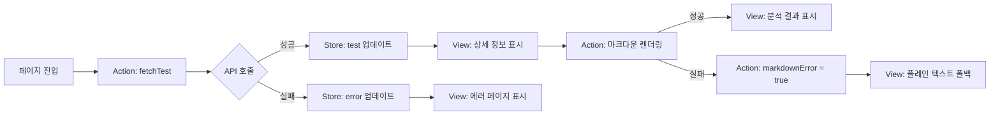
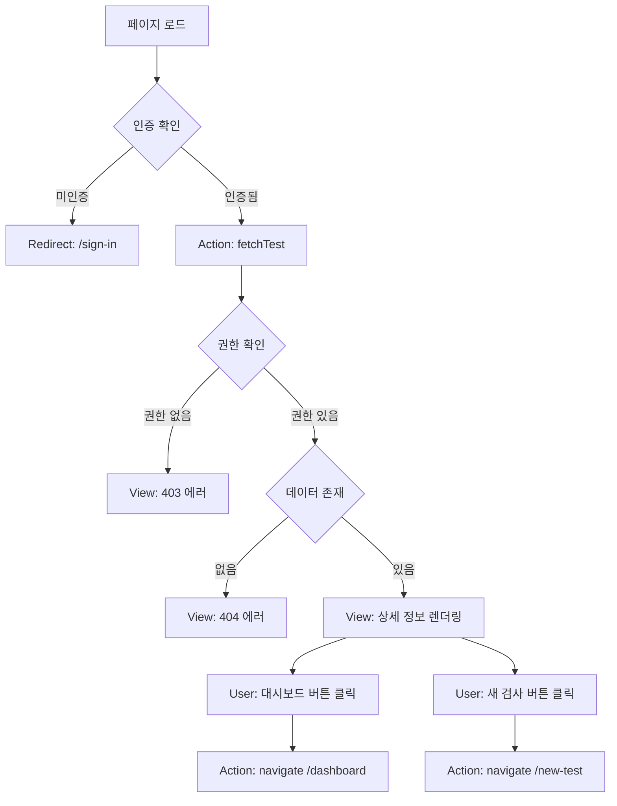
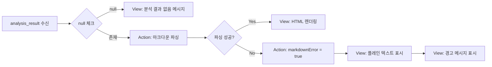

# 분석 상세보기 페이지 상태관리 설계

**페이지**: `/analysis/[id]`
**작성일**: 2025-12-12
**버전**: 1.0

---

## 1. 페이지 개요

### 1.1 목적
- 특정 사주 검사의 상세 분석 결과를 표시
- 검사 대상자의 기본 정보 표시
- AI 분석 결과를 마크다운 형식으로 렌더링

### 1.2 접근 경로
- 대시보드에서 검사 카드 클릭 → `/analysis/[id]`
- 새 검사 완료 후 자동 리다이렉트 → `/analysis/[id]`
- URL 직접 입력 (권한 검증 필요)

### 1.3 접근 제한
- 인증된 사용자만 접근 가능 (Clerk Middleware)
- 자신의 검사 결과만 조회 가능 (Supabase RLS)

---

## 2. 관리해야 할 상태 목록

### 2.1 서버 상태 (React Query)

#### 2.1.1 검사 데이터 (`test`)
- **타입**: `Test`
- **데이터 구조**:
  ```typescript
  interface Test {
    id: string;              // UUID
    user_id: string;         // UUID
    name: string;            // 검사 대상자 이름
    birth_date: string;      // YYYY-MM-DD
    birth_time: string | null; // HH:MM:SS or null
    gender: 'male' | 'female';
    analysis_result: string | null; // 마크다운 형식
    created_at: string;      // ISO 8601
  }
  ```
- **쿼리 키**: `['test', testId]`
- **Endpoint**: `GET /api/test/[id]`
- **Stale Time**: 5분 (분석 결과는 변경되지 않음)
- **Cache Time**: 10분

### 2.2 클라이언트 상태 (useState)

#### 2.2.1 마크다운 렌더링 오류 (`markdownError`)
- **타입**: `boolean`
- **초기값**: `false`
- **목적**: 마크다운 파싱 오류 발생 시 폴백 UI 표시
- **변경 시점**:
  - `react-markdown` 컴포넌트 에러 발생 시 → `true`
  - 정상 렌더링 시 → `false`

---

## 3. 화면에 보이는 데이터 (상태가 아닌 것)

### 3.1 Derived Data (서버 상태에서 파생)

#### 3.1.1 포맷팅된 날짜 (`formattedBirthDate`)
- **원본**: `test.birth_date` (YYYY-MM-DD)
- **변환**: `YYYY년 MM월 DD일`
- **라이브러리**: `date-fns` - `format(parseISO(birth_date), 'yyyy년 MM월 dd일', { locale: ko })`

#### 3.1.2 출생시간 표시 (`formattedBirthTime`)
- **원본**: `test.birth_time` (HH:MM:SS or null)
- **변환**:
  - null → "시간 미상"
  - "14:30:00" → "오후 2시 30분"
- **라이브러리**: `date-fns` - `format(parse(birth_time, 'HH:mm:ss', new Date()), 'a h시 mm분', { locale: ko })`

#### 3.1.3 성별 표시 (`genderLabel`)
- **원본**: `test.gender` ('male' | 'female')
- **변환**:
  - 'male' → "남성"
  - 'female' → "여성"

#### 3.1.4 검사 일시 (`formattedCreatedAt`)
- **원본**: `test.created_at` (ISO 8601)
- **변환**: `YYYY년 MM월 DD일 HH시 MM분`
- **라이브러리**: `date-fns` - `format(parseISO(created_at), 'yyyy년 MM월 dd일 HH시 mm분', { locale: ko })`

### 3.2 정적 데이터

#### 3.2.1 페이지 제목
- "사주팔자 분석 결과"

#### 3.2.2 버튼 라벨
- "대시보드로 돌아가기" (Secondary)
- "새 검사 시작" (Primary)

#### 3.2.3 마크다운 스타일
- 제목 (H2, H3): `text-2xl font-bold`, `text-xl font-semibold`
- 리스트: `list-disc ml-6`
- 인용구: `border-l-4 pl-4 italic`

---

## 4. 상태 변경 조건 및 화면 변화

### 4.1 서버 상태 변경

| 상태 | 변경 조건 | 변경 내용 | 화면 변화 |
|------|----------|----------|----------|
| `test` (loading) | 페이지 진입 직후 | `undefined` → `Test` | 스켈레톤 UI 표시 → 실제 데이터 렌더링 |
| `test` (error) | API 호출 실패 | `undefined` → `Error` | 에러 페이지 표시 (404/403/500) |
| `test` (refetch) | 사용자가 새로고침 버튼 클릭 | 기존 `Test` → 새 `Test` | 로딩 표시 → 업데이트된 데이터 렌더링 |

### 4.2 클라이언트 상태 변경

| 상태 | 변경 조건 | 변경 내용 | 화면 변화 |
|------|----------|----------|----------|
| `markdownError` | `react-markdown` 파싱 오류 | `false` → `true` | 마크다운 렌더링 → 플레인 텍스트 폴백 + 경고 메시지 |
| `markdownError` | 정상 렌더링 | `true` → `false` | 플레인 텍스트 → 마크다운 렌더링 |

---

## 5. Flux 패턴 시각화 (Mermaid)

### 5.1 검사 데이터 로딩 흐름



### 5.2 사용자 액션 흐름



### 5.3 마크다운 렌더링 에러 처리



---

## 6. Context Provider 설계 (선택적)

> **주의**: 이 페이지는 단일 데이터만 다루므로 **Context 불필요**. React Query 훅 직접 사용 권장.

만약 향후 복잡성이 증가할 경우:

```typescript
interface AnalysisDetailContextValue {
  // 서버 상태 (React Query)
  test: Test | undefined;
  isLoading: boolean;
  error: Error | null;

  // 클라이언트 상태
  markdownError: boolean;

  // Actions
  refetch: () => void;
  setMarkdownError: (value: boolean) => void;
}

const AnalysisDetailContext = createContext<AnalysisDetailContextValue | null>(null);

export function AnalysisDetailProvider({ children, testId }: Props) {
  const { data: test, isLoading, error, refetch } = useQuery({
    queryKey: ['test', testId],
    queryFn: () => fetchTest(testId),
    staleTime: 5 * 60 * 1000, // 5분
  });

  const [markdownError, setMarkdownError] = useState(false);

  return (
    <AnalysisDetailContext.Provider
      value={{ test, isLoading, error, refetch, markdownError, setMarkdownError }}
    >
      {children}
    </AnalysisDetailContext.Provider>
  );
}
```

---

## 7. 컴포넌트 구조 및 상태 사용

### 7.1 페이지 컴포넌트 (`app/analysis/[id]/page.tsx`)

```typescript
// Server Component (params는 Promise)
export default async function AnalysisDetailPage({
  params,
}: {
  params: Promise<{ id: string }>;
}) {
  const { id } = await params;

  return <AnalysisDetailClient testId={id} />;
}
```

### 7.2 클라이언트 컴포넌트 (`AnalysisDetailClient.tsx`)

```typescript
'use client';

interface Props {
  testId: string;
}

export function AnalysisDetailClient({ testId }: Props) {
  // React Query로 서버 상태 관리
  const { data: test, isLoading, error } = useQuery({
    queryKey: ['test', testId],
    queryFn: () => apiClient.get(`/api/test/${testId}`).then(res => res.data),
    staleTime: 5 * 60 * 1000,
  });

  // 클라이언트 상태
  const [markdownError, setMarkdownError] = useState(false);

  // 로딩 상태
  if (isLoading) return <AnalysisSkeleton />;

  // 에러 처리
  if (error) return <ErrorPage error={error} />;

  // 데이터 없음
  if (!test) return <NotFoundPage />;

  // 정상 렌더링
  return (
    <div className="max-w-4xl mx-auto">
      <TestInfoCard test={test} />
      <AnalysisResultSection
        result={test.analysis_result}
        onError={() => setMarkdownError(true)}
        hasError={markdownError}
      />
      <ActionButtons />
    </div>
  );
}
```

### 7.3 하위 컴포넌트 목록

#### 7.3.1 `TestInfoCard`
- **Props**: `{ test: Test }`
- **사용 상태**: 없음 (props만 사용)
- **책임**: 검사 대상자 정보 표시 (이름, 생년월일, 출생시간, 성별, 검사 일시)

#### 7.3.2 `AnalysisResultSection`
- **Props**: `{ result: string | null, onError: () => void, hasError: boolean }`
- **사용 상태**: 없음 (props만 사용)
- **책임**:
  - `result`가 null → "분석 결과 없음" 메시지
  - `hasError` true → 플레인 텍스트 + 경고 메시지
  - 정상 → `react-markdown`으로 렌더링

#### 7.3.3 `ActionButtons`
- **Props**: 없음
- **사용 상태**: 없음
- **책임**: "대시보드로 돌아가기", "새 검사 시작" 버튼
- **라우팅**: `next/navigation` - `useRouter`

#### 7.3.4 `AnalysisSkeleton`
- **Props**: 없음
- **사용 상태**: 없음
- **책임**: 로딩 중 스켈레톤 UI 표시

#### 7.3.5 `ErrorPage`
- **Props**: `{ error: Error }`
- **사용 상태**: 없음
- **책임**: HTTP 상태 코드별 에러 페이지 렌더링
  - 404: "검사를 찾을 수 없습니다"
  - 403: "접근 권한이 없습니다"
  - 500: "서버 오류가 발생했습니다"

---

## 8. Context가 노출할 변수 및 함수 (사용하지 않음)

> 이 페이지는 Context 불필요. React Query 훅 직접 사용.

만약 Context 사용 시:

### 8.1 노출 변수
- `test: Test | undefined` - 검사 데이터
- `isLoading: boolean` - 로딩 상태
- `error: Error | null` - 에러 객체
- `markdownError: boolean` - 마크다운 렌더링 에러 상태

### 8.2 노출 함수
- `refetch: () => void` - 데이터 재조회
- `setMarkdownError: (value: boolean) => void` - 마크다운 에러 상태 변경

---

## 9. API Endpoint 명세

### 9.1 검사 상세 조회

**Request**:
```http
GET /api/test/[id]
Authorization: Bearer {Clerk JWT Token}
```

**Response (200 OK)**:
```json
{
  "id": "550e8400-e29b-41d4-a716-446655440000",
  "user_id": "660e8400-e29b-41d4-a716-446655440000",
  "name": "홍길동",
  "birth_date": "1990-05-15",
  "birth_time": "14:30:00",
  "gender": "male",
  "analysis_result": "# 사주팔자 분석 결과\n\n## 천간·지지\n...",
  "created_at": "2025-12-12T10:30:00Z"
}
```

**Response (404 Not Found)**:
```json
{
  "error": "검사를 찾을 수 없습니다"
}
```

**Response (403 Forbidden)**:
```json
{
  "error": "접근 권한이 없습니다"
}
```

---

## 10. 에러 처리 전략

### 10.1 네트워크 에러
- **발생 조건**: API 호출 실패, 타임아웃
- **처리**:
  - React Query의 `retry` 설정 (3회)
  - 최종 실패 시 에러 페이지 표시
  - "다시 시도" 버튼 제공 (`refetch` 호출)

### 10.2 권한 에러 (403)
- **발생 조건**: 다른 사용자의 검사 접근 시도
- **처리**:
  - 에러 페이지 표시: "접근 권한이 없습니다"
  - "대시보드로 돌아가기" 버튼

### 10.3 Not Found (404)
- **발생 조건**: 존재하지 않는 검사 ID 접근
- **처리**:
  - 에러 페이지 표시: "검사를 찾을 수 없습니다"
  - "대시보드로 돌아가기" 버튼

### 10.4 분석 결과 없음 (200 OK, but analysis_result = null)
- **발생 조건**: AI 분석 실패 또는 진행 중
- **처리**:
  - 안내 메시지: "분석 결과가 아직 준비되지 않았습니다"
  - "대시보드로 돌아가기" 버튼

### 10.5 마크다운 파싱 에러
- **발생 조건**: `react-markdown` 렌더링 실패
- **처리**:
  - `markdownError` 상태 → `true`
  - 플레인 텍스트로 폴백 렌더링
  - 경고 메시지: "형식 변환 중 오류가 발생했습니다"

---

## 11. 성능 최적화

### 11.1 React Query 캐싱
- **Stale Time**: 5분 (분석 결과는 변경되지 않음)
- **Cache Time**: 10분
- **Prefetching**: 대시보드에서 카드 호버 시 prefetch 고려

### 11.2 마크다운 렌더링 최적화
- `react-markdown`에 `useMemo` 적용
- 큰 결과는 Code Splitting 고려 (lazy load)

### 11.3 이미지 최적화
- 정보 카드 배경 이미지: `next/image` 사용
- 아이콘: `lucide-react` (Tree Shaking)

---

## 12. 접근성 (Accessibility)

### 12.1 ARIA 레이블
- 정보 카드: `role="region"`, `aria-label="검사 대상자 정보"`
- 분석 결과: `role="article"`, `aria-label="사주팔자 분석 결과"`

### 12.2 키보드 네비게이션
- 버튼: Tab 키로 포커스 이동
- Enter/Space 키로 버튼 클릭

### 12.3 스크린 리더
- 이미지에 `alt` 텍스트
- 로딩 상태: `aria-live="polite"`
- 에러 메시지: `role="alert"`

---

## 13. 테스트 케이스

### 13.1 단위 테스트
- [ ] `formattedBirthDate` 함수 테스트
- [ ] `formattedBirthTime` 함수 테스트 (null 포함)
- [ ] `genderLabel` 변환 테스트
- [ ] `formattedCreatedAt` 함수 테스트

### 13.2 통합 테스트
- [ ] 정상 데이터 로딩 시 렌더링 확인
- [ ] 404 에러 발생 시 에러 페이지 표시 확인
- [ ] 403 에러 발생 시 권한 없음 메시지 확인
- [ ] `analysis_result = null`일 때 안내 메시지 확인
- [ ] 마크다운 파싱 에러 시 폴백 렌더링 확인

### 13.3 E2E 테스트
- [ ] 대시보드에서 검사 카드 클릭 → 상세 페이지 진입
- [ ] 새 검사 완료 후 자동 리다이렉트
- [ ] "대시보드로 돌아가기" 버튼 클릭 → 대시보드 이동
- [ ] "새 검사 시작" 버튼 클릭 → 새 검사 페이지 이동

---

## 14. 향후 개선 사항

### 14.1 인쇄 기능
- "결과 인쇄" 버튼 추가
- CSS `@media print` 스타일 정의

### 14.2 공유 기능
- 링크 복사 버튼 (클립보드 API)
- 소셜 미디어 공유 (이미지 생성 고려)

### 14.3 재분석 요청
- `analysis_result = null`일 때 "재분석 요청" 버튼
- API: `POST /api/test/[id]/reanalyze`

### 14.4 PDF 다운로드
- 분석 결과를 PDF로 변환
- 라이브러리: `jsPDF` 또는 서버사이드 렌더링

---

## 요약

### 핵심 설계 원칙
1. **서버 상태는 React Query로 관리** (Context 불필요)
2. **클라이언트 상태 최소화** (markdownError만 필요)
3. **Derived Data는 컴포넌트 레벨에서 계산** (useMemo 활용)
4. **에러 처리 명확화** (404/403/500/null 분리)
5. **접근성 준수** (ARIA, 키보드 네비게이션)

### 주요 기술 스택
- **상태 관리**: React Query (서버), useState (클라이언트)
- **마크다운**: `react-markdown` + `remark-gfm`
- **날짜**: `date-fns` + `date-fns/locale/ko`
- **라우팅**: `next/navigation` - `useRouter`
- **스타일**: Tailwind CSS

---

**문서 작성 완료**
**작성일**: 2025-12-12
**버전**: 1.0
