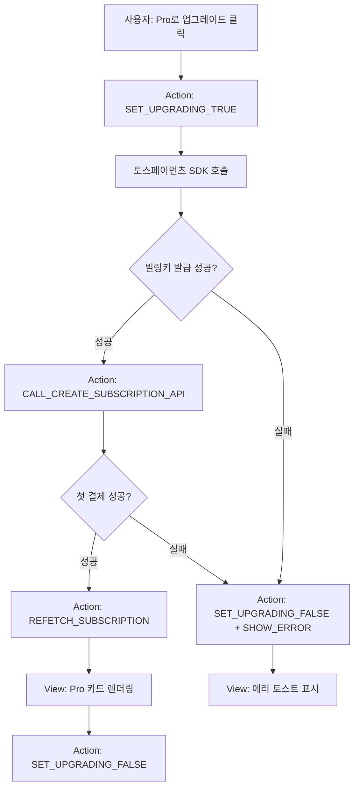
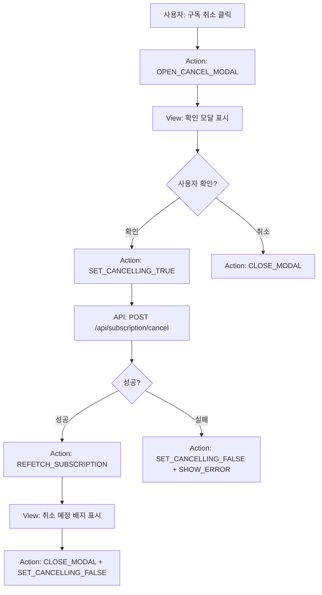
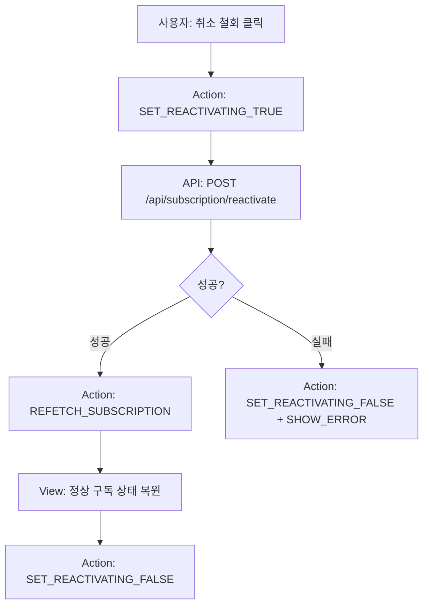
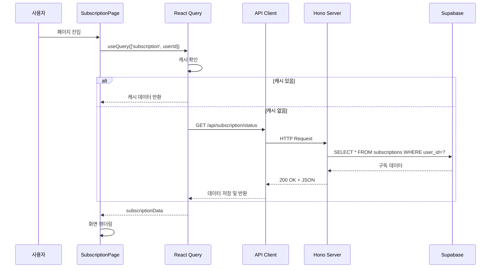
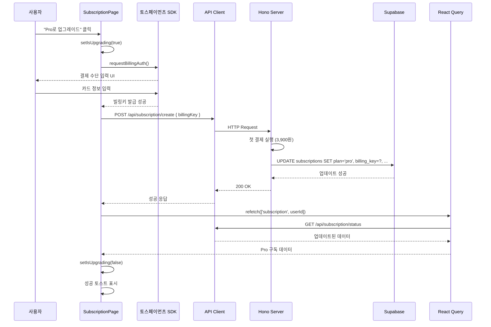
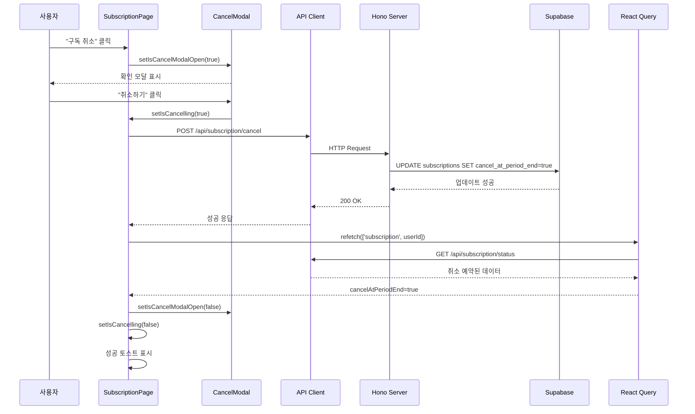

# 구독 관리 페이지 상태 관리 설계

**페이지**: `/subscription`
**작성일**: 2025-12-12
**버전**: 1.0

---

## 1. 페이지 개요

### 1.1 목적
사용자의 현재 구독 상태를 확인하고, Pro 플랜으로 업그레이드하거나 기존 구독을 관리(취소/철회)할 수 있는 페이지입니다.

### 1.2 주요 기능
- 현재 구독 정보 조회 및 표시
- Free → Pro 업그레이드
- Pro 구독 취소 예약
- Pro 구독 취소 철회
- 토스페이먼츠 SDK 연동

---

## 2. 상태 데이터 분류

### 2.1 서버 상태 (React Query)

서버에서 페칭하여 관리하는 데이터:

| 상태명 | 타입 | 설명 | 쿼리 키 | API 엔드포인트 |
|--------|------|------|---------|---------------|
| `subscriptionData` | `SubscriptionData` | 현재 사용자의 구독 정보 | `['subscription', userId]` | `GET /api/subscription/status` |

**SubscriptionData 인터페이스**:
```typescript
interface SubscriptionData {
  plan: 'free' | 'pro';
  remainingTests: number;
  billingKey: string | null;
  nextBillingDate: string | null; // ISO 8601 format
  cancelAtPeriodEnd: boolean;
}
```

### 2.2 클라이언트 상태 (useState)

UI 제어를 위한 로컬 상태:

| 상태명 | 타입 | 초기값 | 설명 |
|--------|------|--------|------|
| `isCancelModalOpen` | `boolean` | `false` | 구독 취소 확인 모달 표시 여부 |
| `isUpgrading` | `boolean` | `false` | Pro 업그레이드 진행 중 (토스 SDK 호출) |
| `isCancelling` | `boolean` | `false` | 구독 취소 처리 중 |
| `isReactivating` | `boolean` | `false` | 구독 철회 처리 중 |

### 2.3 파생 상태 (Computed Values)

서버 상태로부터 계산되는 읽기 전용 값:

| 파생 상태명 | 타입 | 계산 로직 | 용도 |
|------------|------|-----------|------|
| `isPro` | `boolean` | `subscriptionData.plan === 'pro'` | Pro 플랜 여부 판단 |
| `isFree` | `boolean` | `subscriptionData.plan === 'free'` | Free 플랜 여부 판단 |
| `hasBillingKey` | `boolean` | `subscriptionData.billingKey !== null` | 빌링키 존재 여부 |
| `isCancelScheduled` | `boolean` | `subscriptionData.cancelAtPeriodEnd === true` | 취소 예약 상태 여부 |
| `maxTests` | `number` | `subscriptionData.plan === 'pro' ? 10 : 3` | 플랜별 최대 검사 횟수 |
| `modelName` | `string` | `subscriptionData.plan === 'pro' ? 'Gemini 2.5 Pro' : 'Gemini 2.5 Flash'` | 사용 모델 이름 |
| `formattedNextBillingDate` | `string` | `format(parseISO(nextBillingDate), 'yyyy년 MM월 dd일')` | 한국어 포맷 다음 결제일 |

### 2.4 화면에 표시되지만 상태가 아닌 것

| 항목 | 타입 | 설명 |
|------|------|------|
| Pro 플랜 가격 | `const PRO_PRICE = 3900` | 상수로 관리 |
| Free 혜택 목록 | `const FREE_BENEFITS` | 상수 배열 |
| Pro 혜택 목록 | `const PRO_BENEFITS` | 상수 배열 |
| FAQ 아코디언 내용 | `const FAQ_ITEMS` | 정적 데이터 |

---

## 3. 상태 변경 조건 및 화면 반영

### 3.1 구독 정보 조회 (`subscriptionData`)

| 변경 조건 | API 호출 | 화면 변경 사항 |
|-----------|----------|---------------|
| 페이지 마운트 시 | `GET /api/subscription/status` | 구독 정보 카드 렌더링 |
| Pro 업그레이드 성공 | 자동 refetch | Free → Pro 카드 전환, 잔여 횟수 3/3 → 10/10 |
| 구독 취소 성공 | 자동 refetch | "취소 예정" 배지 표시, "구독 취소" → "취소 철회" 버튼 변경 |
| 구독 철회 성공 | 자동 refetch | "취소 예정" 배지 제거, "취소 철회" → "구독 취소" 버튼 변경 |
| Global Nav에서 페이지 재진입 | 캐시 재사용 또는 refetch | 최신 데이터 표시 |

### 3.2 UI 상태 변경

| 상태명 | true로 변경 시점 | false로 변경 시점 | 화면 변경 |
|--------|-----------------|------------------|-----------|
| `isCancelModalOpen` | "구독 취소" 버튼 클릭 | 모달 닫기/확인 | 모달 표시/숨김 |
| `isUpgrading` | "Pro로 업그레이드" 클릭 | 토스 SDK 응답 수신 | 버튼 로딩 스피너 표시 |
| `isCancelling` | 취소 모달에서 "취소하기" 클릭 | API 응답 수신 | 버튼 로딩 스피너 표시 |
| `isReactivating` | "취소 철회" 버튼 클릭 | API 응답 수신 | 버튼 로딩 스피너 표시 |

---

## 4. Flux 패턴 상태 흐름도

### 4.1 Pro 구독 시작 플로우



### 4.2 구독 취소 플로우



### 4.3 구독 철회 플로우



---

## 5. Context 설계 (선택적)

구독 관리 페이지는 단일 페이지로 Context가 필수는 아니지만, Global Nav와 상태를 공유하려면 Context 사용을 고려할 수 있습니다.

### 5.1 SubscriptionContext (선택)

**Context 제공 데이터**:
```typescript
interface SubscriptionContextValue {
  // 서버 상태
  subscriptionData: SubscriptionData | undefined;
  isLoading: boolean;
  isError: boolean;

  // 파생 상태
  isPro: boolean;
  isFree: boolean;
  isCancelScheduled: boolean;
  maxTests: number;
  modelName: string;

  // 액션
  refetchSubscription: () => Promise<void>;
  upgradeToProAction: () => Promise<void>;
  cancelSubscriptionAction: () => Promise<void>;
  reactivateSubscriptionAction: () => Promise<void>;
}
```

**Provider 위치**: `/subscription` 페이지 또는 루트 레이아웃

**하위 컴포넌트**:
- `CurrentSubscriptionCard`: 현재 구독 정보 표시
- `UpgradePromptCard`: Free 사용자에게 업그레이드 유도
- `CancelConfirmModal`: 구독 취소 확인 모달

### 5.2 Context vs Props 비교

| 방식 | 장점 | 단점 | 추천 시나리오 |
|------|------|------|--------------|
| **Context** | - Global Nav와 상태 공유 용이<br>- 깊은 컴포넌트 트리에서 Props Drilling 방지 | - 단일 페이지에서는 과도한 설계<br>- 리렌더링 최적화 필요 | Global Nav와 구독 정보를 실시간 공유해야 할 때 |
| **Props** | - 단순하고 명확<br>- 리렌더링 추적 용이 | - 컴포넌트가 많아지면 Props Drilling 발생 | 구독 페이지만 독립적으로 관리할 때 |

**권장 사항**:
- Global Nav가 구독 정보를 표시하므로 **Zustand Store** 또는 **React Query 전역 캐시**를 활용하는 것이 더 적합합니다.
- 페이지 내부는 Props로 충분합니다.

---

## 6. React Query 흐름 시각화

### 6.1 구독 정보 페칭 흐름



### 6.2 Pro 업그레이드 플로우



### 6.3 구독 취소 플로우



---

## 7. 컴포넌트별 노출 변수 및 함수

### 7.1 SubscriptionPage (페이지 컴포넌트)

**사용 Hooks**:
```typescript
const { data: subscriptionData, isLoading, isError, refetch } = useQuery({
  queryKey: ['subscription', userId],
  queryFn: () => apiClient.get('/api/subscription/status'),
});

const [isCancelModalOpen, setIsCancelModalOpen] = useState(false);
const [isUpgrading, setIsUpgrading] = useState(false);
const [isCancelling, setIsCancelling] = useState(false);
const [isReactivating, setIsReactivating] = useState(false);
```

**파생 상태**:
```typescript
const isPro = subscriptionData?.plan === 'pro';
const isFree = subscriptionData?.plan === 'free';
const isCancelScheduled = subscriptionData?.cancelAtPeriodEnd ?? false;
const maxTests = isPro ? 10 : 3;
const modelName = isPro ? 'Gemini 2.5 Pro' : 'Gemini 2.5 Flash';
```

**핸들러 함수**:
```typescript
const handleUpgradeClick = async () => {
  setIsUpgrading(true);
  try {
    const billingKey = await tossSDK.requestBillingAuth();
    await apiClient.post('/api/subscription/create', { billingKey });
    await refetch();
    toast.success('Pro 구독이 시작되었습니다!');
  } catch (error) {
    toast.error('결제에 실패했습니다.');
  } finally {
    setIsUpgrading(false);
  }
};

const handleCancelClick = () => {
  setIsCancelModalOpen(true);
};

const handleConfirmCancel = async () => {
  setIsCancelling(true);
  try {
    await apiClient.post('/api/subscription/cancel');
    await refetch();
    toast.success('구독 취소가 예약되었습니다.');
    setIsCancelModalOpen(false);
  } catch (error) {
    toast.error('구독 취소에 실패했습니다.');
  } finally {
    setIsCancelling(false);
  }
};

const handleReactivateClick = async () => {
  setIsReactivating(true);
  try {
    await apiClient.post('/api/subscription/reactivate');
    await refetch();
    toast.success('구독 취소가 철회되었습니다.');
  } catch (error) {
    toast.error('철회에 실패했습니다.');
  } finally {
    setIsReactivating(false);
  }
};
```

**렌더링 로직**:
```typescript
if (isLoading) return <LoadingSpinner />;
if (isError) return <ErrorMessage />;

return (
  <div>
    {isFree && (
      <>
        <CurrentSubscriptionCard plan="free" remainingTests={subscriptionData.remainingTests} />
        <UpgradePromptCard onUpgrade={handleUpgradeClick} isLoading={isUpgrading} />
      </>
    )}
    {isPro && (
      <CurrentSubscriptionCard
        plan="pro"
        remainingTests={subscriptionData.remainingTests}
        nextBillingDate={subscriptionData.nextBillingDate}
        isCancelScheduled={isCancelScheduled}
        onCancel={handleCancelClick}
        onReactivate={handleReactivateClick}
        isCancelling={isCancelling}
        isReactivating={isReactivating}
      />
    )}
    <CancelConfirmModal
      isOpen={isCancelModalOpen}
      onClose={() => setIsCancelModalOpen(false)}
      onConfirm={handleConfirmCancel}
      isLoading={isCancelling}
      nextBillingDate={subscriptionData?.nextBillingDate}
    />
  </div>
);
```

### 7.2 CurrentSubscriptionCard

**Props**:
```typescript
interface CurrentSubscriptionCardProps {
  plan: 'free' | 'pro';
  remainingTests: number;
  nextBillingDate?: string | null;
  isCancelScheduled?: boolean;
  onCancel?: () => void;
  onReactivate?: () => void;
  isCancelling?: boolean;
  isReactivating?: boolean;
}
```

**렌더링 로직**:
- Free 플랜: 잔여 횟수, 사용 모델, 혜택 목록
- Pro 플랜: 잔여 횟수, 다음 결제일, 사용 모델, "구독 취소" 또는 "취소 철회" 버튼
- 취소 예정 상태: "취소 예정" 배지, 경고 메시지

### 7.3 UpgradePromptCard

**Props**:
```typescript
interface UpgradePromptCardProps {
  onUpgrade: () => void;
  isLoading: boolean;
}
```

**렌더링 로직**:
- Pro 플랜 혜택 강조
- "지금 시작하기" 버튼 (로딩 스피너 포함)

### 7.4 CancelConfirmModal

**Props**:
```typescript
interface CancelConfirmModalProps {
  isOpen: boolean;
  onClose: () => void;
  onConfirm: () => void;
  isLoading: boolean;
  nextBillingDate?: string | null;
}
```

**렌더링 로직**:
- 확인 메시지
- 다음 결제일 표시
- "취소하기" (Danger 버튼) / "돌아가기" (Secondary 버튼)

---

## 8. 에러 처리 및 엣지 케이스

### 8.1 API 에러 처리

| 에러 시나리오 | HTTP 상태 | 처리 방법 |
|--------------|-----------|----------|
| 구독 정보 조회 실패 | 500 | 에러 메시지 표시 + "다시 시도" 버튼 |
| 이미 Pro 구독 중인 사용자가 업그레이드 시도 | 409 | "이미 Pro 구독 중입니다" 토스트 |
| 구독 취소 실패 (네트워크 오류) | - | "구독 취소에 실패했습니다. 다시 시도해주세요" 토스트 |
| 빌링키 발급 실패 | - | "결제에 실패했습니다. 결제 수단을 확인해주세요" 토스트 |

### 8.2 UI 상태 처리

| 시나리오 | 처리 방법 |
|---------|----------|
| 로딩 중 사용자가 다시 버튼 클릭 | 버튼 비활성화 (isLoading 상태 체크) |
| 모달 열린 상태에서 ESC 키 | onClose 호출 |
| 구독 데이터 없음 (404) | "구독 정보를 찾을 수 없습니다. 고객센터에 문의해주세요" 표시 |

---

## 9. 성능 최적화

### 9.1 React Query 캐싱 전략

```typescript
const queryClient = new QueryClient({
  defaultOptions: {
    queries: {
      staleTime: 1000 * 60 * 5, // 5분 (구독 정보는 자주 변경되지 않음)
      cacheTime: 1000 * 60 * 10, // 10분
      refetchOnWindowFocus: false, // 탭 전환 시 불필요한 refetch 방지
    },
  },
});
```

### 9.2 컴포넌트 메모이제이션

```typescript
const CurrentSubscriptionCard = React.memo(({ plan, remainingTests, ... }) => {
  // ...
});

const handleUpgradeClick = useCallback(async () => {
  // ...
}, [refetch]);
```

### 9.3 번들 최적화

- 토스페이먼츠 SDK는 dynamic import로 로드
```typescript
const loadTossSDK = async () => {
  const { loadTossPayments } = await import('@tosspayments/payment-sdk');
  return loadTossPayments(clientKey);
};
```

---

## 10. 테스트 시나리오

### 10.1 단위 테스트

- [ ] Free 플랜 사용자에게 UpgradePromptCard 표시
- [ ] Pro 플랜 사용자에게 취소 버튼 표시
- [ ] 취소 예약 상태일 때 "취소 철회" 버튼 표시
- [ ] 로딩 중 버튼 비활성화

### 10.2 통합 테스트

- [ ] Pro 업그레이드 플로우 (토스 SDK → API 호출 → refetch)
- [ ] 구독 취소 플로우 (모달 → API 호출 → 상태 변경)
- [ ] 구독 철회 플로우

### 10.3 E2E 테스트

- [ ] Free 사용자가 Pro로 업그레이드 후 화면 변경 확인
- [ ] Pro 사용자가 구독 취소 후 "취소 예정" 배지 표시 확인
- [ ] 취소 철회 후 정상 상태로 복원 확인

---

## 11. 구현 체크리스트

### 백엔드 API
- [ ] `GET /api/subscription/status` - 구독 정보 조회
- [ ] `POST /api/subscription/create` - Pro 구독 시작
- [ ] `POST /api/subscription/cancel` - 구독 취소 예약
- [ ] `POST /api/subscription/reactivate` - 구독 철회

### 프론트엔드
- [ ] React Query 훅 설정
- [ ] 토스페이먼츠 SDK 통합
- [ ] SubscriptionPage 컴포넌트
- [ ] CurrentSubscriptionCard 컴포넌트
- [ ] UpgradePromptCard 컴포넌트
- [ ] CancelConfirmModal 컴포넌트
- [ ] 에러 처리 및 토스트 메시지
- [ ] 로딩 스피너 UI

### 통합
- [ ] Global Nav와 구독 정보 동기화
- [ ] 잔여 횟수 실시간 업데이트
- [ ] 라우팅 및 리다이렉트

---

## 12. 향후 개선 사항

### 12.1 기능 추가
- 결제 내역 조회 페이지 (`/payments`)
- 이메일 알림 (결제 성공/실패)
- 플랜 비교 표 (Free vs Pro)

### 12.2 UX 개선
- Pro 업그레이드 시 애니메이션 효과
- 구독 취소 시 "정말 떠나시나요?" 메시지
- 다음 결제일까지 남은 일수 표시

### 12.3 성능 개선
- Optimistic Update (취소/철회 즉시 UI 반영)
- Prefetch (대시보드에서 구독 페이지 hover 시 미리 로드)

---

**문서 작성 완료**
**작성일**: 2025-12-12
**버전**: 1.0
